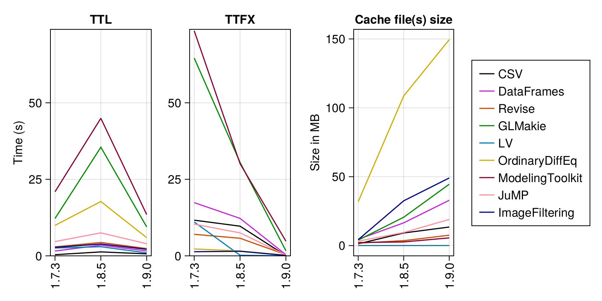
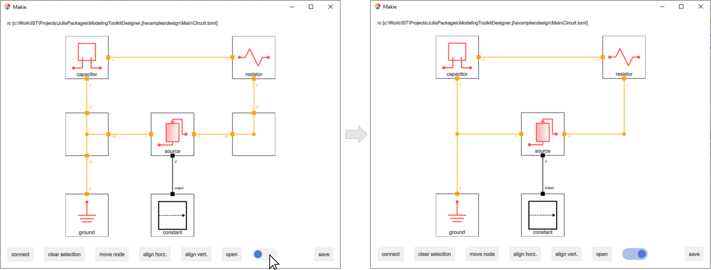

# MakieCon highlights

We like to thank the [Max Planck Institute for Biogeochemistry](https://www.bgc-jena.mpg.de/5632072/makiecon) for hosting MakieCon 23, the [Julia Numfocus Project](https://numfocus.org/donate-to-julia) for supporting us with travel funds and [Dr. Lazaro Alonso Silva](https://github.com/sponsors/lazarusA) for organizing MakieCon.

At MakieCon, we were happy to announce that Makie is now the most starred Julia plotting library:

[](https://star-history.com/#MakieOrg/Makie.jl&JuliaPlots/Plots.jl&GiovineItalia/Gadfly.jl&JuliaPy/PyPlot.jl&jheinen/GR.jl&JuliaPlots/UnicodePlots.jl&Date)

While one shouldn't put too much emphasis on GitHub star counts, we like to think that it's an indicator that Makie is on a good trajectory and people are excited to see where it's going next.

We recorded all talks, which you can watch in the MakieCon playlist on youtube:

```julia
# hide
using BonitoSites, Bonito
DOM.div(map(readdir(Blog.assetpath("images", "makiecon-cards"); join=true)) do img
    DOM.a(DOM.img(src=Bonito.Asset(img), style="height: 64px"), href="https://www.youtube.com/playlist?list=PLP8iPy9hna6TXEn99mhG5KaTgjsrCkDzQ")
end...)
```


## Fast TopoPlots and Julia native interpolator

At MakieCon, we successfully addressed the reliance of TopPlots on numerous Python packages for rendering. As a result, we have effectively eliminated most of the Python dependencies, while also improving the performance. You can find more info in the [PR](https://github.com/MakieOrg/TopoPlots.jl/issues/31).


```julia
# hide
using BonitoSites, Bonito
Blog.gh_by("behinger", "fatteneder")
```

## `Observable{Vector{PlotSpec}}` prototype


[This prototype](https://github.com/MakieOrg/Makie.jl/pull/2868) can be used by recipes when the number and type of plots depend on the input data, rather than just the input types.

It extends the functionality of the existing `PlotSpec` infrastructure and allows for the creation and deletion of plots as needed. It is compatible with any backend.

This functionality is crucial for improving the integration of WGLMakie within Pluto. While Pluto lacks support for UIs via Observables like Makie, it follows a declarative style where users write out the complete plot command for each animation step. Having an efficient declarative API in Makie will ensure compatibility between WGLMakie and Pluto.

```julia
# hide
Blog.gh_by("asinghvi17", "SimonDanisch")
```


## A datashader implementation

James A. Bednar delivered an [exceptional keynote at MakieCon](https://www.youtube.com/watch?v=5ORTZQQ2NGQ), where he introduced the Python package [datashader](https://datashader.org).

This presentation sparked immediate inspiration within the Makie community, leading to the [development of an initial prototype for Makie](https://github.com/MakieOrg/Makie.jl/pull/2883).

This plot type was implemented as a recipe and proves particularly useful for exploring vast amounts of data (ranging from millions to billions of points) that may encounter issues like [overplotting](https://datashader.org/user_guide/Plotting_Pitfalls.html#overplotting) and [over/under saturation](https://datashader.org/user_guide/Plotting_Pitfalls.html#oversaturation).

The [preliminary documentation](https://docs.makie.org/previews/PR2883/examples/plotting_functions/datashader/) includes an example showcasing the interactive speed of "shading" 2.7 billion points on a laptop:


Once the implementation is finalized, we will publish an official announcement with a blog post elaborating on the details.

```julia
# hide
Blog.gh_by("jkrumbiegel", "cjdoris", "SimonDanisch")
```

## Progress on axes in nonlinear spaces


We were able to understand and present a lot of what is required to have generic nonlinear axes in Makie enabling many projection types in GeoMakie:
```julia
# hide
url = "https://user-images.githubusercontent.com/32143268/236643880-b0d577f8-dfd4-45ec-9098-57cbb6a8c441.png"
DOM.div(DOM.img(src=url), style="overflow: auto; max-width: 800px; max-height: 300px")
```
These were implemented in a [PR](https://github.com/MakieOrg/GeoMakie.jl/pull/163) to GeoMakie, and we've had some success so far.  Work is still ongoing to make this a well integrated axis type, though!

```julia
# hide
Blog.gh_by("asinghvi17", "SimonDanisch")
```

## Scatterjitter

Benedikt Ehinger also worked on [a recipe](https://github.com/MakieOrg/Makie.jl/pull/2872), which makes it easy to introduce some jitter to points, so that one can better judge their distribution:


```julia
# hide
Blog.gh_by("behinger")
```

---

# New Makie Release: v0.19.5

Some highlights from the 0.19.5 release:

## More fixes for line rendering in GLMakie

[Frederic Freyer](https://github.com/ffreyer) went all in on fixing remaining issues with the new line rendering from [v0.19.3](https://github.com/MakieOrg/Makie.jl/pull/2666).
See the well documented [PR](https://github.com/MakieOrg/Makie.jl/pull/2843) for more information about the challenges!

## Added contour labels [#2496](https://github.com/MakieOrg/Makie.jl/pull/2496)

[t-bltg](https://github.com/t-bltg) put lots of work into [enabling proper contour labels for Makie](https://docs.makie.org/stable/examples/plotting_functions/contour/index.html#contour):


## Fixes for `Makie.inline!()` [#2919](https://github.com/MakieOrg/Makie.jl/pull/2919) [#2937](https://github.com/MakieOrg/Makie.jl/pull/2937)

We now allow and default to `Makie.inline!(automatic)`, which is better at automatically opening a window / inlining a plot into plo tpane when needed [#2919](https://github.com/MakieOrg/Makie.jl/pull/2919) [#2937](https://github.com/MakieOrg/Makie.jl/pull/2937)

## Block/Axis doc improvements [#2940](https://github.com/MakieOrg/Makie.jl/pull/2940) [#2932](https://github.com/MakieOrg/Makie.jl/pull/2932) [#2894](https://github.com/MakieOrg/Makie.jl/pull/2894)

We got a lot of feedback regarding Makie's documentation during MakieCon. Many users feel that while it contains a lot of information, it could be structured more clearly. A system for structuring documentation that has been gaining popularity is the four-sector system from the folks at [divio](https://documentation.divio.com/) which separates tutorials, how-to's, explanations and references.

There is an ongoing effort to make plotting function and `Block` documentation pages more reference-like, with more focused examples for each attribute or keyword argument, and extended help functionality in the Julia REPL. In the future, we'd like to add more complex how-to's, an area in which the separate project [Beautiful Makie](https://beautiful.makie.org/dev/) has been stronger than the official documentation in the past.

---

# Exciting developments


## [Julia v1.9 release](https://julialang.org/blog/2023/04/julia-1.9-highlights/)

The 1.9 release is a great release for Makie 🙂
It substantially improves time to first plot and time to load the package:



Also, it fixes [a long standing issue](https://github.com/JuliaGL/GLFW.jl/issues/198) for GLMakie users with AMD GPU on linux, which [got backported to 1.8.4](https://github.com/JuliaGL/GLFW.jl/issues/198#issuecomment-1367567883).


## [Miner.jl](https://github.com/ashwani-rathee/Miner.jl)

Miner.jl is a MineCraft clone written entirely in Julia and Makie.
It's still a prototype, but already shows that it's possible to create a game with Makie, showing off the flexibility and performance Makie offers:

```julia
# hide
DOM.img(src=Blog.asset("images", "miner.gif"))
```

```julia
# hide
Blog.gh_by("ashwani-rathee")
```

## [ModelingToolkitDesigner.jl](https://github.com/bradcarman/ModelingToolkitDesigner.jl)

A really new and exciting package.
From the README:

> The ModelingToolkitDesigner.jl package is a helper tool for visualizing and editing ModelingToolkit.jl system connections.



```julia
# hide
Blog.gh_by("bradcarman")
```

## [Tyler](https://github.com/MakieOrg/Tyler.jl)

Tyler.jl is a package which plots large images performantly by breaking them up into a set of "tiles". This is often used for interactive maps where tiles are downloaded on demand.
Tyler was written to work well with any [tile provider](https://github.com/JuliaGeo/TileProviders.jl), and therefore offers similar functionality as Leaflet.

During MakieCon and before, lots of cool use cases have been opened up:


### [SegmentAnything.jl](https://github.com/rafaqz/SegmentAnything.jl)

Simon Danisch has made an [initial demo](https://github.com/SimonDanisch/MakieSAM.jl) directly calling [segment-anything](https://github.com/facebookresearch/segment-anything) via PyCall and integrating it with Tyler, to easily segment satellite data:


Rafael Schouten took this demo and created [SegmentAnything.jl](https://github.com/rafaqz/SegmentAnything.jl) from it, which wraps the python dependencies much nicer via PythonCall.

```julia
# hide
Blog.gh_by("rafaqz", "SimonDanisch")
```

### Greenland ice loss

Alex S. Gardner has added [a great example](https://makieorg.github.io/Tyler.jl/dev/examples/generated/UserGuide/iceloss_ex/), visualizing ice loss in Greenland interactively:
```julia
# hide
BonitoSites.Video("https://github-production-user-asset-6210df.s3.amazonaws.com/1010467/238302902-51fb905a-99a8-4627-9318-727eb2bb4455.mp4")
```

```julia
# hide
Blog.gh_by("alex-s-gardner")
```


### [OSMMakie](https://github.com/MakieOrg/OSMMakie.jl)

OSMMakie has been around for a while, but it's great to see that it smoothly integrates with Tyler.jl, so one can plot all the vector data on top of any tyler map:

```julia
# hide
BonitoSites.Video("https://user-images.githubusercontent.com/1010467/212502607-640a2238-0f24-4efd-8ce9-fafba46f80bd.mp4")
```

### [PyramidSchemes.jl](https://github.com/JuliaDataCubes/PyramidScheme.jl)

A Gaussian pyramid is a hierarchical structure of scaled-down images created using Gaussian filters and subsampling. It is commonly used in map data applications like Google Maps to efficiently handle different levels of detail. PyramidSchemes.jl was started at MakieCon and promises to do the same for large arrays on disk and a [smooth integration with Tyler.jl](https://github.com/MakieOrg/Tyler.jl/issues/44).

```julia
# hide
Blog.gh_by("felixcremer", "meggart")
```

## [GtkMakie.jl](https://github.com/JuliaGtk/GtkMakie.jl)

Jared Wahlstrand took the heroic task of wrapping [Gtk4](https://github.com/JuliaGtk/Gtk4.jl) which works well on windows and finally allows for OpenGL integration working on all platforms which allows for a native GLMakie integration. The package is in its early days, but already quite usable:


```julia
# hide
Blog.gh_by("jwahlstrand", "SimonDanisch")
```


## [TidierPlots](https://github.com/TidierOrg/TidierPlots.jl)

People have been looking for a ggplot equivalent in Julia for quite some time, and now we have a new Package for it:

>TidierPlots.jl is a 100% Julia implementation of the R package ggplot in Julia. Powered by the AlgebraOfGraphics.jl, Makie.jl, and Julia’s extensive meta-programming capabilities, TidierPlots.jl is an R user’s love letter to data visualization in Julia.

```julia
# hide
using TidierPlots
ENV["DATADEPS_ALWAYS_ACCEPT"] = true
nothing
```

```julia
using CairoMakie; CairoMakie.activate!(type=:png)
using TidierPlots, PalmerPenguins, DataFrames
penguins = dropmissing(DataFrame(PalmerPenguins.load()))
ggplot(data = penguins) +
    geom_bar(@aes(x = species)) +
    labs(x = "Species")
```

```julia
# hide
Blog.gh_by("rdboyes", "pdimens")
```

# Social Media

You can follow Makie's development on many social media networks.
Twitter is right now the most used one, but since it's a dying platform we hope to move things to any of the other platforms:

- [julialang.social/@makie](https://julialang.social/@makie)
- [makieplots.bsky.social](https://staging.bsky.app/profile/makieplots.bsky.social)
- [www.linkedin.com/company/makieorg](https://www.linkedin.com/company/makieorg)
- [medium.com/@makieorg](https://medium.com/@makieorg)
- [discord](https://discord.gg/2FBjYAT3cY)
- [twitter.com/MakiePlots](https://twitter.com/MakiePlots)
