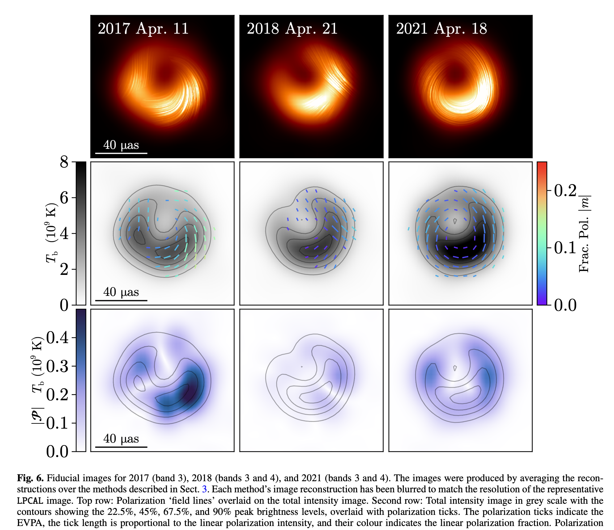
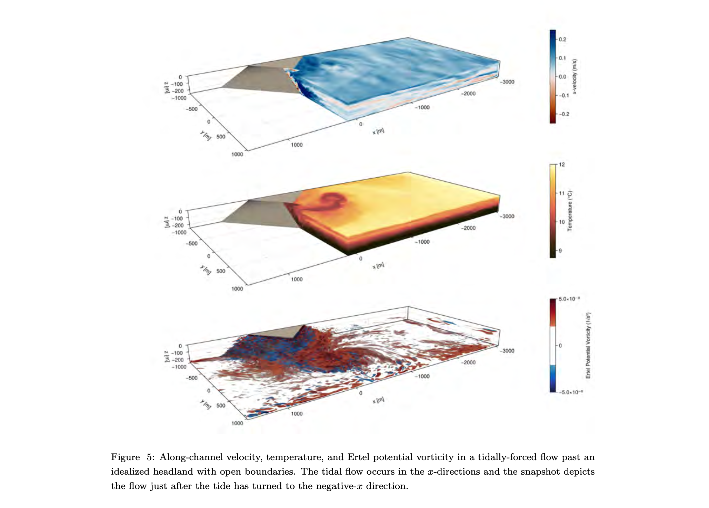
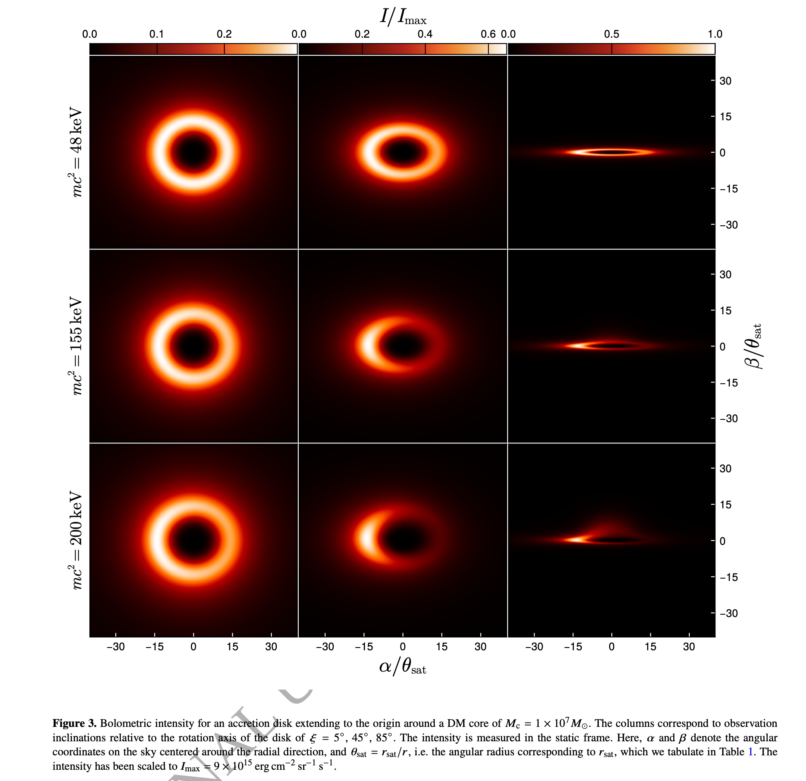
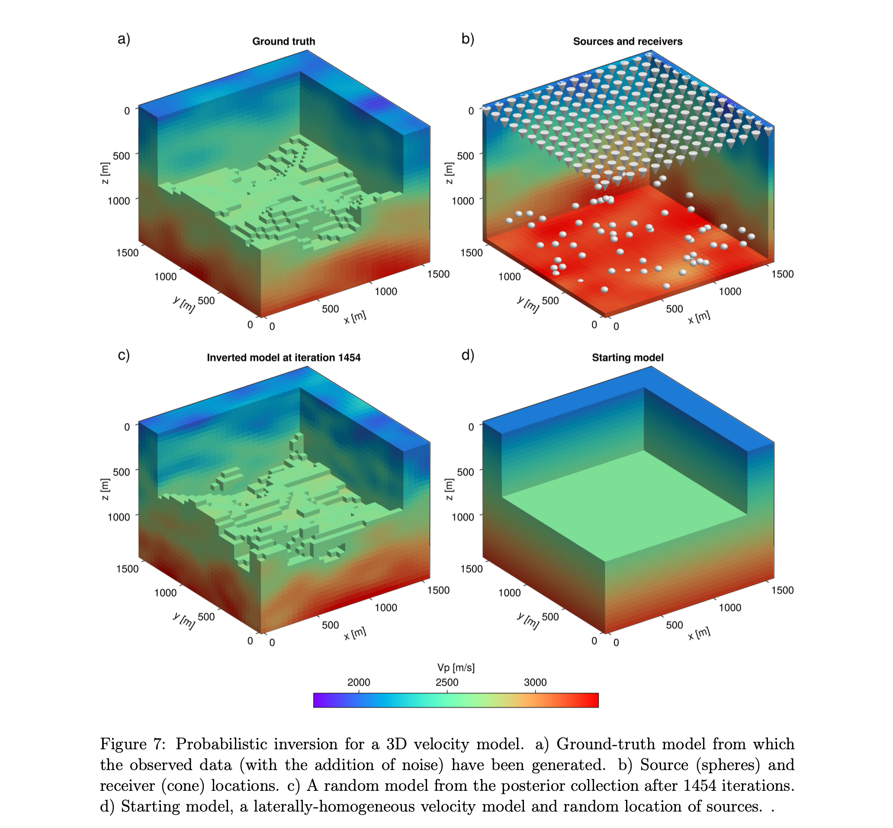
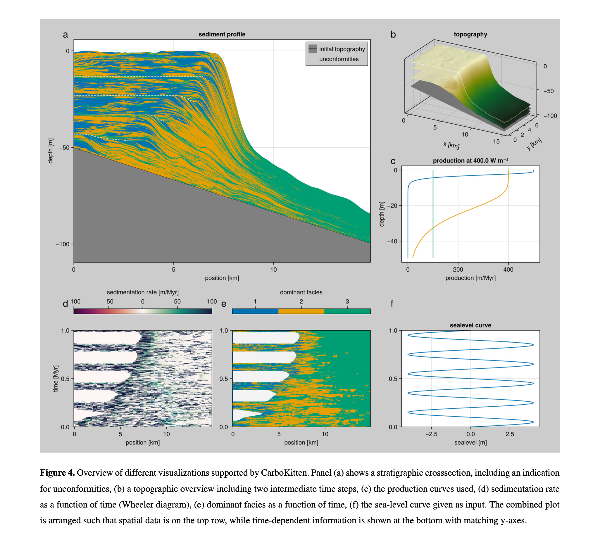
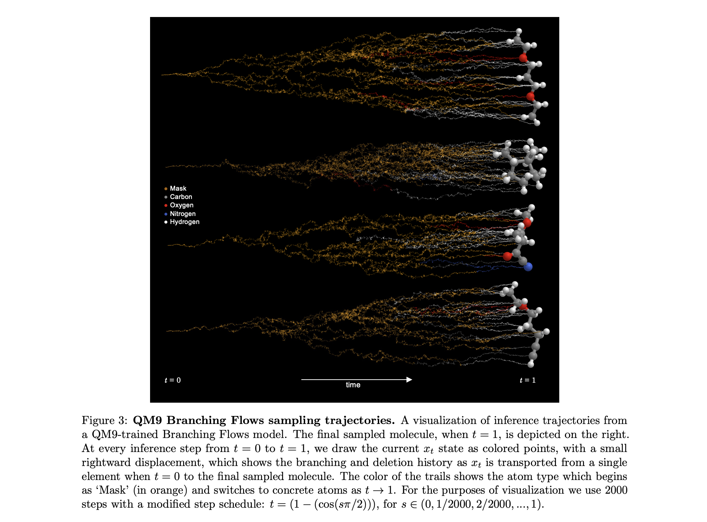
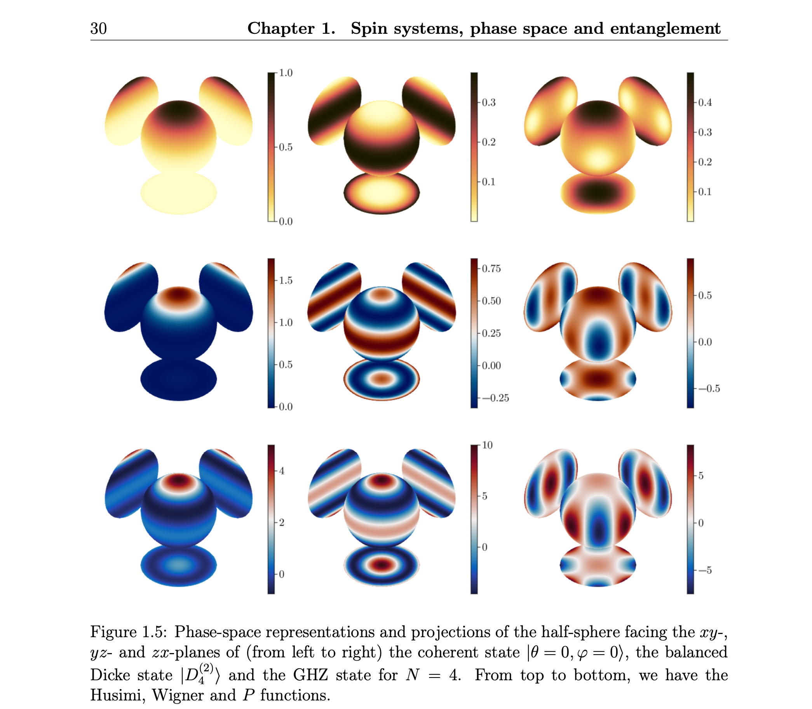
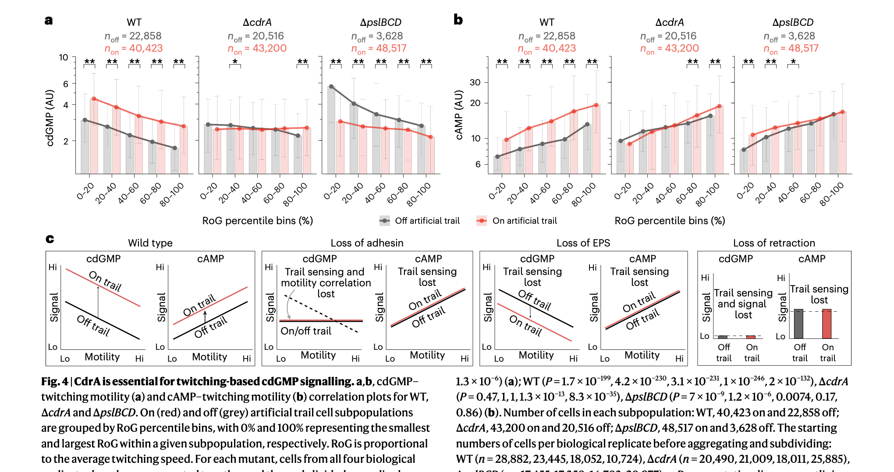
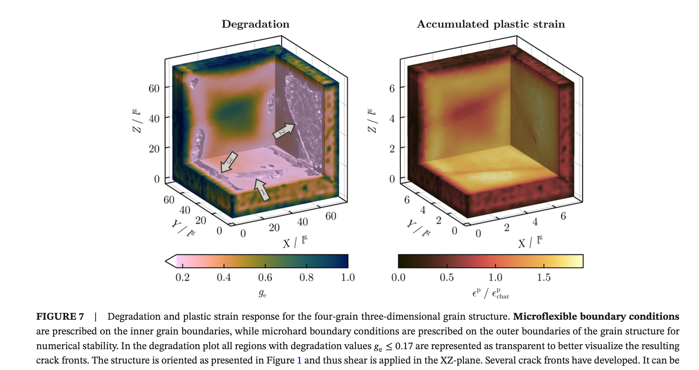
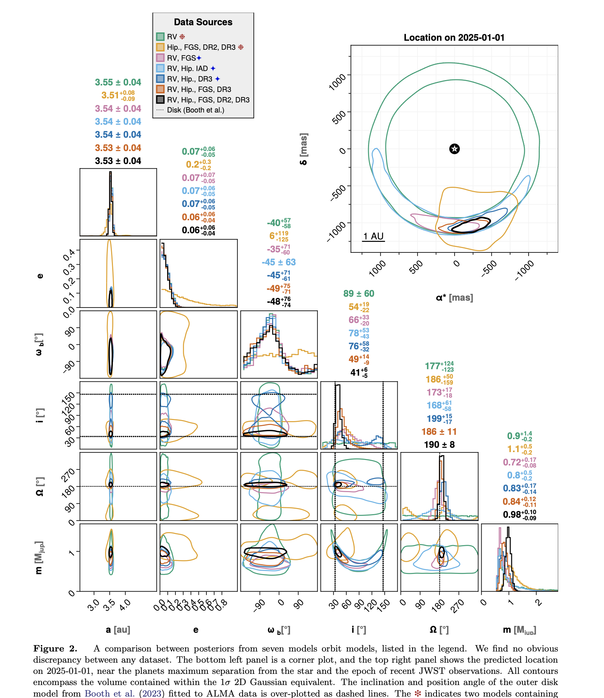

# Cool Makie Papers: Science Visualized with Makie.jl

We've collected some cool recent papers that use Makie.jl for their figures and visualizations. They cover a nice range of fields, from black hole imaging and ocean modeling to quantum physics and biofilm research. Here we highlight ten of them with a short summary and a representative figure each.

If you're using Makie in your research and would like to be featured in a future blog post, [please contact us](https://makie.org/website/contact)!

## Horizon-Scale Variability of M87* from 2017-2021 EHT Observations

The Event Horizon Telescope Collaboration presents three epochs of polarized images of the supermassive black hole M87* at 230 GHz, taken in 2017, 2018, and 2021. All observations reveal a bright, asymmetric ring with a persistent diameter of 43.9 microarcseconds, consistent with the shadow of a supermassive black hole. The total intensity and linear polarization vary significantly across the three epochs, probing the dynamic properties of the horizon-scale accretion flow. Published in *Astronomy & Astrophysics* (2025).

[The Event Horizon Telescope Collaboration](https://eventhorizontelescope.org/), [Kazunori Akiyama](https://scholar.google.com/citations?user=8bKoaKIAAAAJ), [Antxon Alberdi](https://scholar.google.com/citations?user=VuPFi8kAAAAJ)

## High-Level, High-Resolution Ocean Modeling at All Scales with Oceananigans

Oceananigans is a new ocean modeling software written in Julia, developed by the Climate Modeling Alliance as part of a larger effort to build a trainable climate model. It combines a simple finite volume algorithm optimized for GPU-accelerated high-resolution simulations with an expressive, high-level user interface. The software can simulate everything from millimeter-scale turbulence to planetary-scale ocean circulation. Submitted to *JAMES*.

[Gregory L. Wagner](https://scholar.google.com/citations?user=sk8OQUEAAAAJ), [Simone Silvestri](https://scholar.google.com/citations?user=akJfBk4AAAAJ), [Raffaele Ferrari](https://scholar.google.com/citations?user=E5SuIBsAAAAJ)

## Imaging Fermionic Dark Matter Cores at the Center of Galaxies

This study investigates whether dense fermionic dark matter cores at galactic centers can produce observational signatures similar to black holes when illuminated by an accretion disk. Using general-relativistic ray tracing, the authors show that these DM cores produce images with a central brightness depression surrounded by a ring-like feature, closely resembling a black hole scenario. A key difference: the DM cores lack photon rings, which could help discriminate between the models. Published in *Monthly Notices of the Royal Astronomical Society* (2024).

[J. Pelle](https://scholar.google.com/citations?user=mNnOk-8AAAAJ), [C. R. Argüelles](https://scholar.google.com/citations?user=jn03i_oAAAAJ), [F. L. Vieyro](https://scholar.google.com/citations?user=_vUL5W0AAAAJ)

## A Discrete Adjoint Method for Seismic Traveltime Inversion

Seismic traveltime tomography is a powerful tool for unravelling subsurface structure. This work addresses the eikonal-equation-based inversion problem using a discrete adjoint state method that provides gradients with respect to both velocity structure and source locations. The approach enables deterministic inversion via L-BFGS and probabilistic inversion via Hamiltonian Monte Carlo, demonstrated on synthetic 2D and 3D examples. Published on *arXiv* (2025).

[Andrea Zunino](https://scholar.google.com/citations?user=Z7_5TwIAAAAJ), [Scott Keating](https://scholar.google.com/citations?user=Ow1VjCgAAAAJ), [Andreas Fichtner](https://scholar.google.com/citations?user=P_P8k1sAAAAJ)

## CarboKitten.jl: An Open Source Toolkit for Carbonate Stratigraphic Modeling

CarboKitten is a stratigraphic forward modeling toolkit for carbonate platforms, implemented in Julia with a focus on performance and accessibility. It integrates carbonate production, cellular automata for spatial heterogeneity, and a finite difference transport model. The software can simulate scenarios from centuries to millions of years, including orbital forcing and sea level change, and exports beautiful visualizations including stratigraphic cross-sections and topographic maps. Published as a preprint on *EGUsphere* (2025).

[Johan Hidding](https://scholar.google.com/citations?user=3MiJ2ZQAAAAJ), [Emilia Jarochowska](https://scholar.google.com/citations?user=m-Vgo2sAAAAJ), [Peter Burgess](https://scholar.google.com/citations?user=VPSYce4AAAAJ)

## Branching Flows: Discrete, Continuous, and Manifold Flow Matching with Splits and Deletions

Branching Flows is a generative modeling framework that transports a simple distribution to the data distribution via a forest of binary trees with learned branching and deletion rates. Unlike standard diffusion and flow matching methods, it naturally handles variable-length sequences in continuous, discrete, and manifold spaces. The method is demonstrated on small molecule generation, antibody sequence generation, and protein backbone generation. Published on *arXiv* (2025).

[Hedwig Nora Nordlinder](https://scholar.google.com/citations?user=M3Grf4AAAAAJ), [Lukas Billera](https://scholar.google.com/citations?user=gN4vvKEAAAAJ), [Ben Murrell](https://scholar.google.com/citations?user=_cwIFsUAAAAJ)

## Bridging Concepts of Quantumness: Phase-Space, Entanglement and Anticoherence in Spin Systems

This PhD thesis from Université de Liège bridges multiple concepts of quantumness in spin systems through phase-space representations. The work features beautiful visualizations of Husimi, Wigner, and P functions on spheres for various quantum states including coherent states, Dicke states, and GHZ states. The thesis uses Makie to render these intricate phase-space representations with striking clarity. PhD thesis, Université de Liège (2025-2026).

[Jérôme Denis](https://scholar.google.com/citations?user=vdqpw4oAAAAJ), supervised by [John Martin](https://scholar.google.com/citations?user=_7RXbKUAAAAJ)

## Pseudomonas aeruginosa Senses Exopolysaccharide Trails Using Type IV Pili and Adhesins During Biofilm Formation

During early biofilm formation, *Pseudomonas aeruginosa* can sense exopolysaccharide (EPS) trails deposited by previous cells to detect trajectories and orchestrate motility. This paper reveals a previously unknown mechanochemical surveillance mechanism where type IV pili interact with cell-body adhesins and surface-deposited EPS to drive second messenger signalling and motility. Published in *Nature Microbiology* (2025).

[William C. Schmidt](https://scholar.google.com/citations?user=s4lC3i8AAAAJ), [Calvin K. Lee](https://scholar.google.com/citations?user=VwpUw7EAAAAJ), [Gerard C. L. Wong](https://scholar.google.com/citations?user=R_w3i7IAAAAJ)

## Phase-Field Modeling of Ductile Fracture Across Grain Boundaries in Polycrystals

This paper extends a thermodynamic phase-field fracture framework from single crystals to polycrystalline structures using gradient-enhanced crystal plasticity. A novel microflexible boundary condition couples slip transmission resistance with phase-field damage, allowing realistic simulation of crack propagation across grain boundaries. The 3D visualizations of degradation and plastic strain in multi-grain structures are particularly impressive. Published in the *International Journal for Numerical Methods in Engineering* (2025).

[Kim Louisa Auth](https://scholar.google.com/citations?user=WqQRbHUAAAAJ), [Jim Brouzoulis](https://scholar.google.com/citations?user=dV3ABIUAAAAJ), [Magnus Ekh](https://scholar.google.com/citations?user=pAkT2CYAAAAJ)

## Revised Mass and Orbit of Epsilon Eridani b: A 1 Jupiter-Mass Planet on a Near-Circular Orbit

This paper performs a thorough joint reanalysis of all available radial velocity and astrometry data for the nearby exoplanet Epsilon Eridani b, combining data from eight RV instruments and four astrometric sources spanning 40 years. The planet's mass is revised to 0.98 Jupiter masses on a nearly circular orbit, close to coplanar with the outer debris disk. The complex corner plots beautifully demonstrate Makie's capabilities for multi-parameter Bayesian analysis visualization. Submitted to *The Astronomical Journal* (2025).

[William Thompson](https://scholar.google.com/citations?user=FmDk3VsAAAAJ), [Eric L. Nielsen](https://scholar.google.com/citations?user=WNFQOBAAAAAJ), [Christian Marois](https://scholar.google.com/citations?user=gYBJoFkAAAAJ)

