# Cool Makie Papers: Science Visualized with Makie.jl

We've collected some cool recent papers that use Makie.jl for their figures and visualizations. They cover a nice range of fields, from black hole imaging and ocean modeling to quantum physics and biofilm research. Here we highlight ten of them, each with the paper's own abstract and a representative figure.

A small disclaimer: we can't know for certain exactly how each figure was produced, but they look like Makie to us and the papers cite Makie. If we got something wrong, please open an issue or PR at [MakieOrg/Website](https://github.com/MakieOrg/Website).

If you're using Makie in your research and would like to be featured in a future blog post, [please contact us](https://makie.org/website/contact)!

## [Horizon-scale variability of M87* from 2017–2021 EHT observations](https://arxiv.org/abs/2509.24593)

**Authors:** The Event Horizon Telescope Collaboration

**Venue:** Astronomy & Astrophysics (accepted), 2025

> We report three epochs of polarized images of M87* at 230 GHz using data from the Event Horizon Telescope (EHT) taken in 2017, 2018, and 2021. The baseline coverage of the 2021 observations is significantly improved through the addition of two new EHT stations: the 12 m Kitt Peak Telescope and the Northern Extended Millimetre Array (NOEMA). All observations result in images dominated by a bright, asymmetric ring with a persistent diameter of 43.9±0.6 μas, consistent with expectations for lensed synchrotron emission encircling the apparent shadow of a supermassive black hole. We find that the total intensity and linear polarization of M87 vary significantly across the three epochs. Specifically, the azimuthal brightness distribution of the total intensity images varies from year to year, as expected for a stochastic accretion flow. However, despite a gamma-ray flare erupting in M87 quasi-contemporaneously to the 2018 observations, the 2018 and 2021 images look remarkably similar. The resolved linear polarization fractions in 2018 and 2021 peak at ~5%, compared to ~15% in 2017. The spiral polarization pattern on the ring also varies from year to year, including a change in the electric vector position angle helicity in 2021 that could reflect changes in the magnetized accretion flow or an external Faraday screen. The improved 2021 coverage also provides the first EHT constraints on jet emission outside the ring, on scales of ≲1 mas. Overall, these observations provide strong proof of the reliability of the EHT images and probe the dynamic properties of the horizon-scale accretion flow surrounding M87.

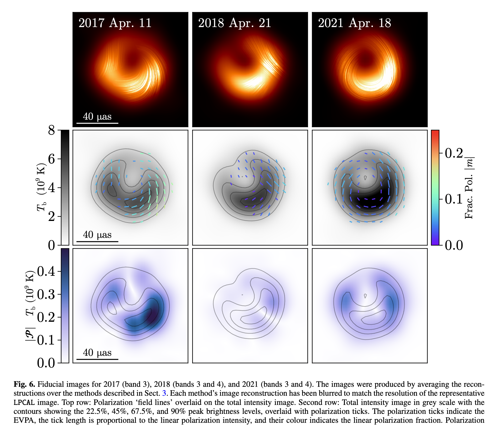

## [High-level, high-resolution ocean modeling at all scales with Oceananigans](https://arxiv.org/abs/2502.14148)

**Authors:** Gregory L. Wagner, Simone Silvestri, Navid C. Constantinou, et al.

**Venue:** Submitted to *Journal of Advances in Modeling Earth Systems* (JAMES), 2025

> We describe the vision, user interface, governing equations, and numerical methods that underpin new ocean modeling software called "Oceananigans". Oceananigans is being developed by the Climate Modeling Alliance as part of a larger project to build a trainable climate model with quantifiable uncertainty. We argue that Oceananigans status as a popular, capable modeling system realizes a vision for accelerating progress in Earth system modeling that balances demands for model accuracy and performance, needed for state-of-the-art science, against accessibility, which is needed to accelerate development. This vision combines three cooperative elements: (i) a relatively simple finite volume algorithm (ii) optimized for high-resolution simulations on GPUs which is (iii) exposed behind an expressive, high-level user interface (using the Julia programming language in our case). We offer evidence for the vision's potential by illustrating the creative potential of our user interface, showcasing Oceananigans physics with example simulations that range from simple classroom problems to a realistic global ocean simulation spanning all scales of oceanic fluid motion, and describing advances in parameterization, numerical methods, and computational efficiency.

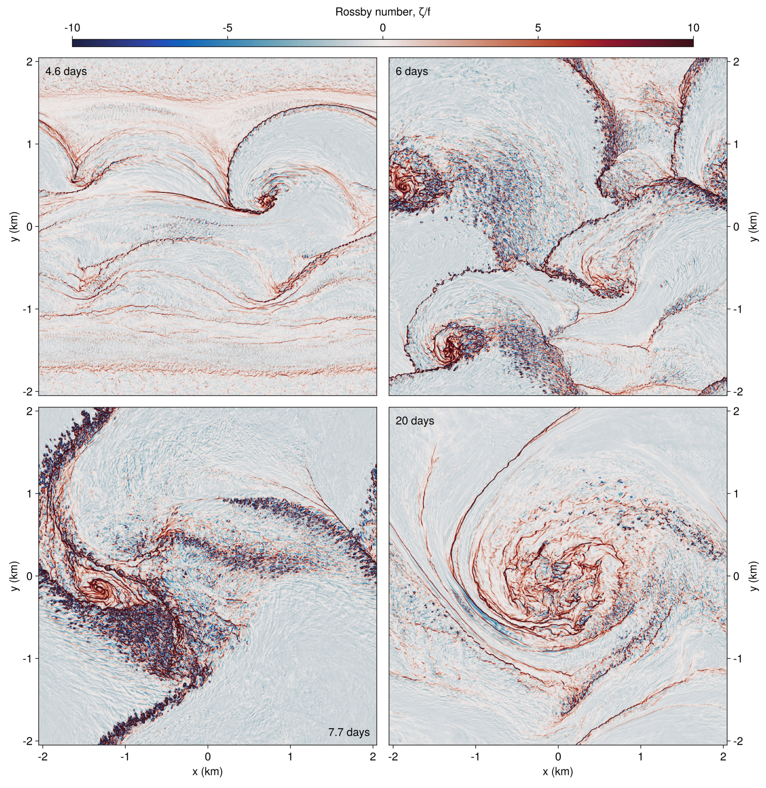

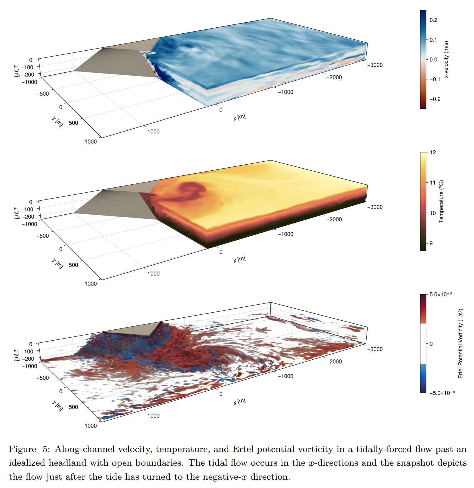

## [Imaging fermionic dark matter cores at the center of galaxies](https://academic.oup.com/mnras/article/534/2/1217/7759710)

**Authors:** Joaquin Pelle, Carlos R. Argüelles, Florencia L. Vieyro, et al.

**Venue:** *Monthly Notices of the Royal Astronomical Society*, Vol. 534, Issue 2, pp. 1217–1226 (2024)

> Current images of the supermassive black hole (SMBH) candidates at the center of our Galaxy and M87 have opened an unprecedented era for studying strong gravity and the nature of relativistic sources. Very-long-baseline interferometry (VLBI) data show images consistent with a central SMBH within General Relativity (GR). However, it is essential to consider whether other well-motivated dark compact objects within GR could produce similar images. Recent studies have shown that dark matter (DM) halos modeled as self-gravitating systems of neutral fermions can harbor very dense fermionic cores at their centers, which can mimic the spacetime features of a black hole (BH). Such dense, horizonless DM cores can satisfy the observational constraints: they can be supermassive and compact and lack a hard surface. We investigate whether such cores can produce similar observational signatures to those of BHs when illuminated by an accretion disk. We compute images and spectra of the fermion cores with a general-relativistic ray tracing technique, assuming the radiation originates from standard α disks, which are self-consistently solved within the current DM framework. Our simulated images possess a central brightness depression surrounded by a ring-like feature, resembling what is expected in the BH scenario. For Milky Way-like halos, the central brightness depressions have diameters down to ∼35 μas as measured from a distance of approximately 8 kpc. Finally, we show that the DM cores do not possess photon rings, a key difference from the BH paradigm, which could help discriminate between the models.

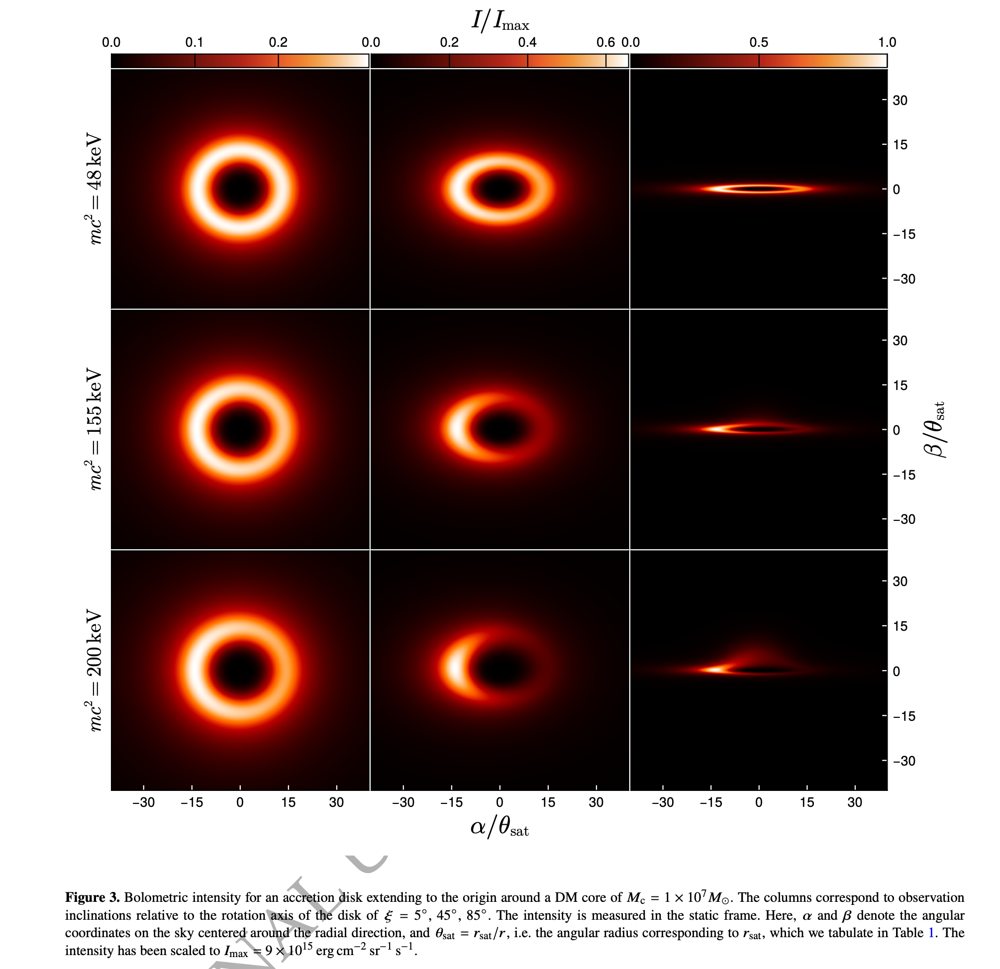

## [A discrete adjoint method for deterministic and probabilistic eikonal-equation-based inversion of traveltime for velocity and source location](https://academic.oup.com/gji/article/243/1/ggaf283/8213531)

**Authors:** Andrea Zunino, Scott Keating, Andreas Fichtner

**Venue:** *Geophysical Journal International*, 2025 (preprint: [arXiv:2501.13532](https://arxiv.org/abs/2501.13532))

> Seismic traveltime tomography represents a popular and useful tool for unravelling the structure of the subsurface across the scales. In this work we address the case where the forward model is represented by the eikonal equation and derive a formalism to solve the inverse problem where gradients are calculated efficiently using the discrete adjoint state method. Our approach provides gradients with respect to both velocity structure and source locations, allowing us to perform a consistent joint inversion. The forward problem is solved using a second-order fast-marching method, which provides a strategy to efficiently solve the adjoint problem. Our approach allows for arbitrary positions of both sources and receivers and for a refined grid around the source region to reduce errors in computed traveltimes. We show how gradients computed using the discrete adjoint method can be employed to perform either deterministic inversion, i.e., solving an optimization problem, or for a probabilistic (Bayesian) approach, i.e., obtaining a posterior probability density function. We show applications of our methodology on a set of synthetic examples both in 2D and 3D using the L-BFGS algorithm for the deterministic case and the Hamiltonian Monte Carlo algorithm for the probabilistic case.

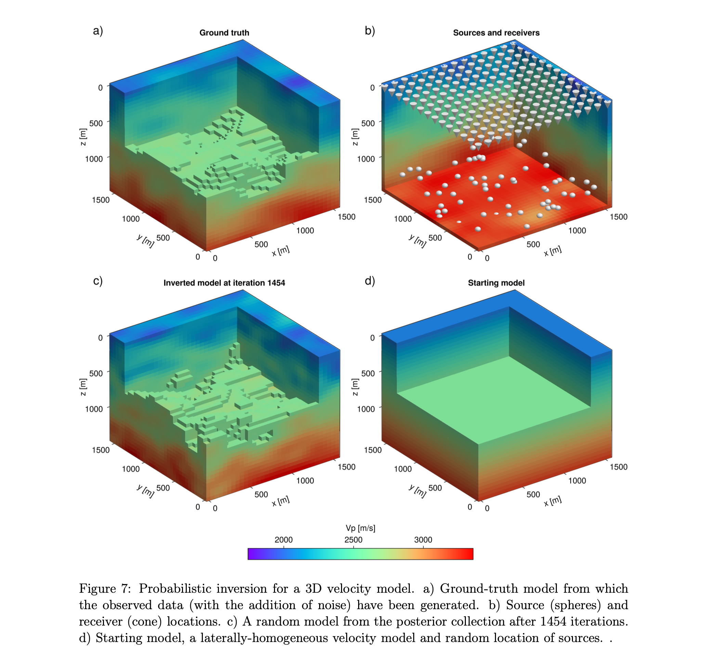

## [CarboKitten.jl – an open source toolkit for carbonate stratigraphic modeling](https://egusphere.copernicus.org/preprints/2025/egusphere-2025-4561/)

**Authors:** Johan Hidding, Emilia Jarochowska, Niklas Hohmann, Xianyi Liu, Peter Burgess, Hanno Spreeuw

**Venue:** *EGUsphere* preprint, 2025

> Stratigraphic forward modeling is a powerful tool for testing hypotheses about the geological record and conduct numerical experiments in stratigraphy at timescales not accessible to human observation. Open Source software for stratigraphic modeling available so far has focused on siliciclastic or terrestrial depositional environments. We present CarboKitten, a stratigraphic forward modeling toolkit for carbonate platforms. With performance and accessibility in mind, CarboKitten is implemented in Julia, using the literate programming approach.
>
> CarboKitten integrates three components: the carbonate production model of Boscher and Schlager (1992), the cellular automaton for spatial heterogeneity introduced by Burgess (2013), and a novel finite difference transport model inspired by Paola et al. (1992). The model simulates carbonate production through multiple biological factories (typically euphotic, oligophotic and aphotic), accounts for ecological processes that create spatial facies patterns through cellular automaton rules, and implements sediment transport via an active layer approach where material moves along paths of steepest descent.
>
> Key features include support for different boundary conditions, variable sea level and insolation inputs, wave-induced transport capabilities, and visualization tools aiming at beautiful plots. The software exports data in the interoperable HDF5 format and includes functions for creating stratigraphic cross-sections, chronostratigraphic diagrams, topographic maps, and sediment accumulation curves. Performance benchmarks demonstrate linear scaling with grid size and time steps, enabling efficient execution on consumer hardware.
>
> CarboKitten addresses a gap in available carbonate modeling tools by providing an accessible, well-documented, and modifiable toolkit for hypothesis testing in carbonate stratigraphy. The model operates on timescales from centuries to millions of years and can simulate various scenarios including orbital forcing, sea level change, and biological succession patterns. CarboKitten's accessibility should encourage broader adoption of stratigraphic forward modeling in carbonate research and education, supporting hypothesis-driven approaches to understanding the structure of the geological record and reconstructing the history of the Earth from carbonate strata.

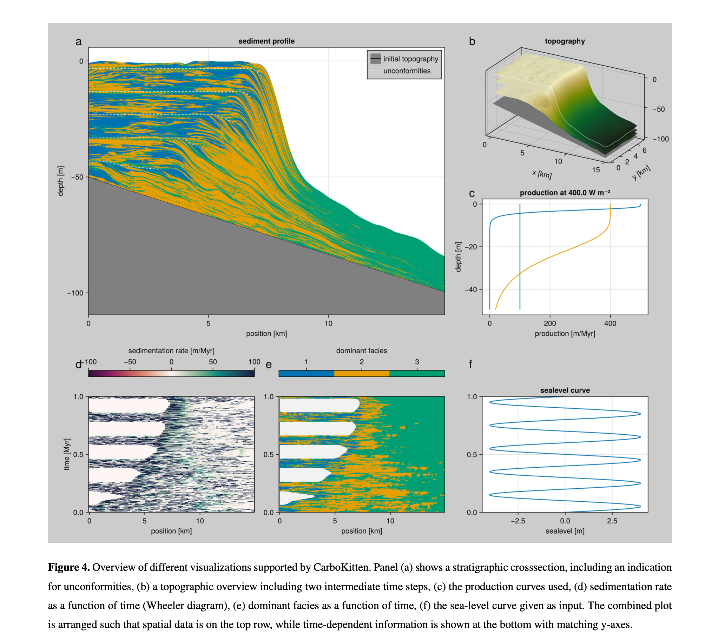

## [Branching Flows: Discrete, Continuous, and Manifold Flow Matching with Splits and Deletions](https://arxiv.org/abs/2511.09465)

**Authors:** Hedwig Nora Nordlinder*, Lukas Billera*, Jack Collier Ryder, et al. (*contributed equally)

**Venue:** arXiv preprint, 2025

> Diffusion and flow matching approaches to generative modeling have shown promise in domains where the state space is continuous, such as image generation or protein folding & design, and discrete, exemplified by diffusion large language models. They offer a natural fit when the number of elements in a state is fixed in advance (e.g. images), but require ad hoc solutions when, for example, the length of a response from a large language model, or the number of amino acids in a protein chain is not known a priori. Here we propose Branching Flows, a generative modeling framework that, like diffusion and flow matching approaches, transports a simple distribution to the data distribution. But in Branching Flows, the elements in the state evolve over a forest of binary trees, branching and dying stochastically with rates that are learned by the model. This allows the model to control, during generation, the number of elements in the sequence. We also show that Branching Flows can compose with any flow matching base process on discrete sets, continuous Euclidean spaces, smooth manifolds, and `multimodal' product spaces that mix these components. We demonstrate this in three domains: small molecule generation (multimodal), antibody sequence generation (discrete), and protein backbone generation (multimodal), and show that Branching Flows is a capable distribution learner with a stable learning objective, and that it enables new capabilities.

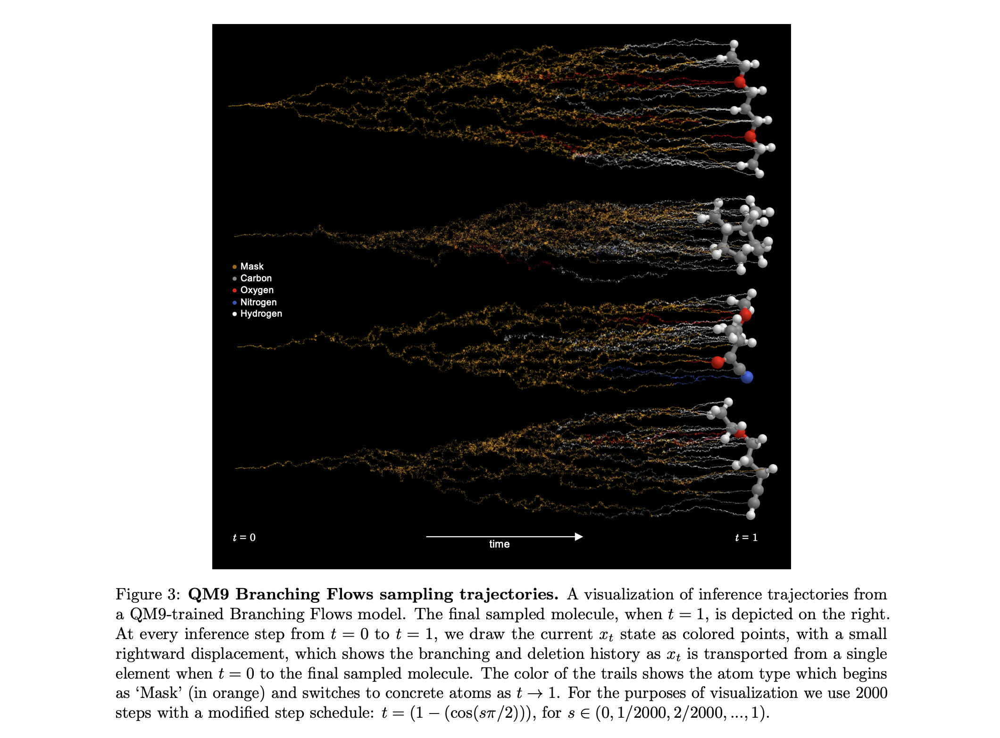

## [Bridging Concepts of Quantumness: Phase-space, Entanglement and Anticoherence in Spin Systems](https://www.sciences.uliege.be/cms/c_13528483/en/soutenance-de-these-de-jerome-denis)

**Author:** Jérôme Denis (supervisor: John Martin)

**Venue:** PhD thesis, Université de Liège, defended 30 September 2025

> In quantum physics, several concepts have been developed to capture the distinctive characteristics of quantum states that have no classical equivalent. Among the most important are non-locality, entanglement and non-classicality, the latter generally identified with the negativity of quasi-probability distributions in phase space. More recently, the idea of anticoherence, defined by the isotropy of spin states resulting from quantum superpositions, has emerged as another distinctive feature of quantum states.
>
> Although these different forms of "quantumness" are becoming increasingly central to the understanding and development of quantum foundations and quantum technologies, and are becoming experimentally accessible, their fundamental nature and interconnections are still only partially understood. The aim of this thesis is two-fold. First, we study and characterise the quantum nature of spin states through entanglement, non-classicality and anticoherence, with a particular focus on the relationships between these concepts. Second, we propose and analyse experimental protocols for estimating the entanglement of multiqubit states and for generating maximally entangled anticoherent states, thereby paving the way for their use in future quantum applications.

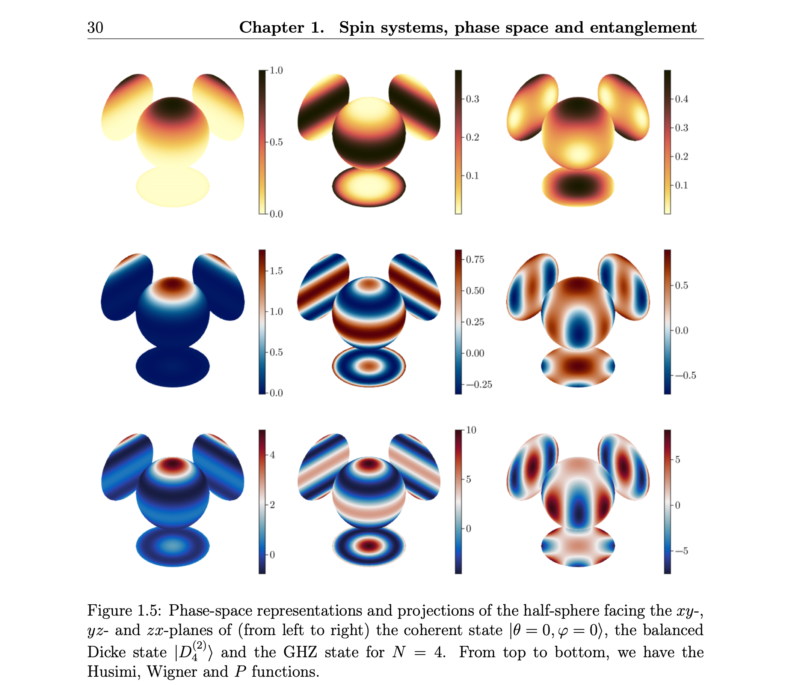

## [Pseudomonas aeruginosa senses exopolysaccharide trails using type IV pili and adhesins during biofilm formation](https://www.nature.com/articles/s41564-025-02087-4)

**Authors:** William C. Schmidt, Calvin K. Lee, Xuhui Zheng, et al.

**Venue:** *Nature Microbiology*, Vol. 10, Issue 10, pp. 2511–2520 (October 2025)

> During early stages of biofilm formation, Pseudomonas aeruginosa (Pa) PAO1 can sense exopolysaccharide (EPS) trails of Psl deposited on a surface by previous Pa cells to detect trajectories of other cells and to orchestrate motility. This sensory signal is transduced into cyclic diGMP second messengers, but no known Psl receptors and adhesins participate in signal transduction. Here, using bacteria-secreted Psl trails, glycopolymer-patterned surfaces, longitudinal cell tracking, second messenger dual reporters and genetic mutations targeting EPS binding and surface twitching, we find that Pa is capable of sensing EPS directly through mutually constitutive interactions between type IV pili (T4P)-powered twitching and specific adhesin-EPS bonds. This unanticipated mechanochemical surveillance of the Pa environment, where T4P pull against cell-body localized adhesins interacting with EPS trails, such as mannose-binding CdrA, generates a hybrid, transitional planktonic-to-biofilm population with elevated cyclic diGMP and elevated cyclic AMP, as well as increased motility capable of following EPS trails. These results show a generalizable mechanism of surface chemosensing through mechanosensitive appendages.

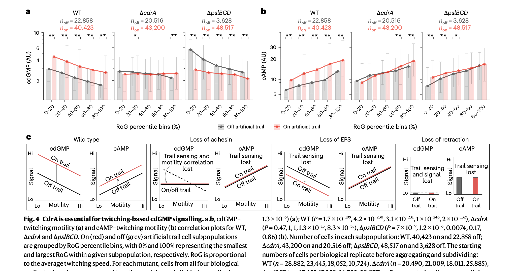

## [Phase-field modeling of ductile fracture across grain boundaries in polycrystals](https://onlinelibrary.wiley.com/doi/10.1002/nme.70056)

**Authors:** Kim Louisa Auth, Jim Brouzoulis, Magnus Ekh

**Venue:** *International Journal for Numerical Methods in Engineering*, 2025 (preprint: [arXiv:2410.24107](https://arxiv.org/abs/2410.24107))

> In this study, we address damage initiation and microcrack formation in ductile failure of polycrystalline metals. We show how our recently published thermodynamic framework for ductile phase-field fracture of single crystals can be extended to polycrystalline structures. A key feature of this framework is that it accounts for size effects by adopting gradient-enhanced (crystal) plasticity. Gradient-enhanced plasticity requires the definition of boundary conditions representing the plastic slip transmission resistance of the boundaries. In this work, we propose a novel type of microflexible boundary condition for gradient-plasticity, which couples the slip transmission resistance with the phase-field damage such that the resistance locally changes during the fracturing process. The formulation allows maintaining the effect of grain boundaries as obstacles for plastic slip during plastification, while also accounting for weakening of their resistance during the softening phase. In numerical experiments, the new damage-dependent boundary condition is compared to classical microfree and microhard boundary conditions in polycrystals, and it is demonstrated that it indeed produces a response that transitions from microhard to microfree as the material fails. We show that the formulation maintains resistance to slip transmission during hardening, but can generate microcracks across grain boundaries during the fracture process. We further show examples of how the model can be used to simulate void coalescence and three-dimensional crack fronts in polycrystals.

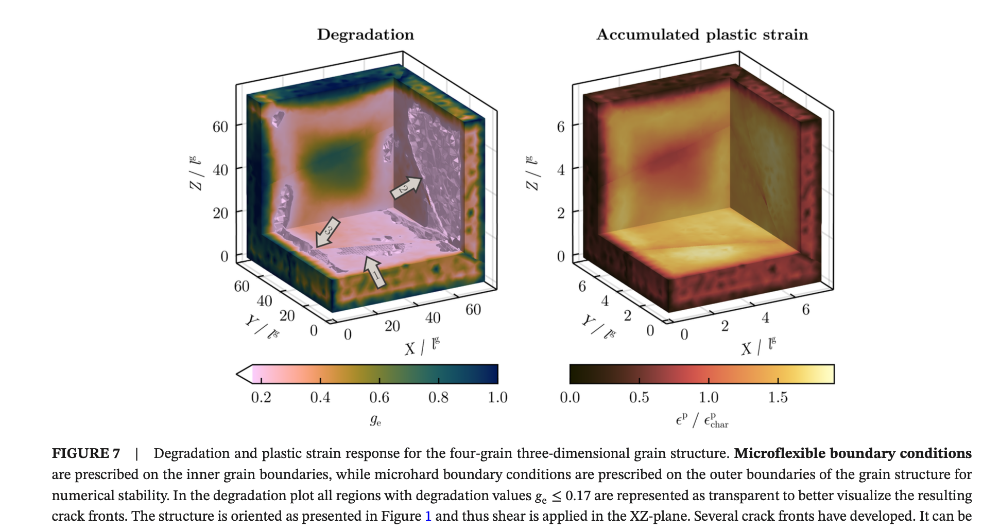

## [Revised Mass and Orbit of ε Eridani b: A 1 Jupiter-Mass Planet on a Near-Circular Orbit](https://arxiv.org/abs/2502.20561)

**Authors:** William Thompson, Eric Nielsen, Jean-Baptiste Ruffio, Sarah Blunt, Christian Marois

**Venue:** Accepted at *The Astronomical Journal*, 2025

> The mature Jovian planet ε Eridani b orbits one of the closest sun-like stars at a moderate separation of 3.5 AU, presenting one of the best opportunities to image a true analog to a solar system planet. We perform a thorough joint reanalysis and cross-validation of all available archival radial velocity and astrometry data, combining data from eight radial velocity instruments and four astrometric sources (Hipparcos, Hubble FGS, Gaia DR2, and Gaia DR3). We incorporate methodological advances that impact our findings including a principled treatment of correlation between Gaia DR2 and DR3 velocity and corrections for the changing light-travel time to this high proper motion system. We revise the planet's mass upward to 0.98 ± 0.09 M_jup and find that its orbit is nearly circular and close to coplanar with the outer debris disk. We further present one of the first models of an exoplanet orbit exclusively from absolute astrometry and independently confirm the planet's orbital period. We make specific predictions for the planet's location at key imaging epochs from past and future observing campaigns. We discuss and resolve tensions between previous works regarding the eccentricity, inclination, and mass. Our results further support that ε Eridani b is one of the closest analogs to a Solar System planet yet detected around a nearby star.

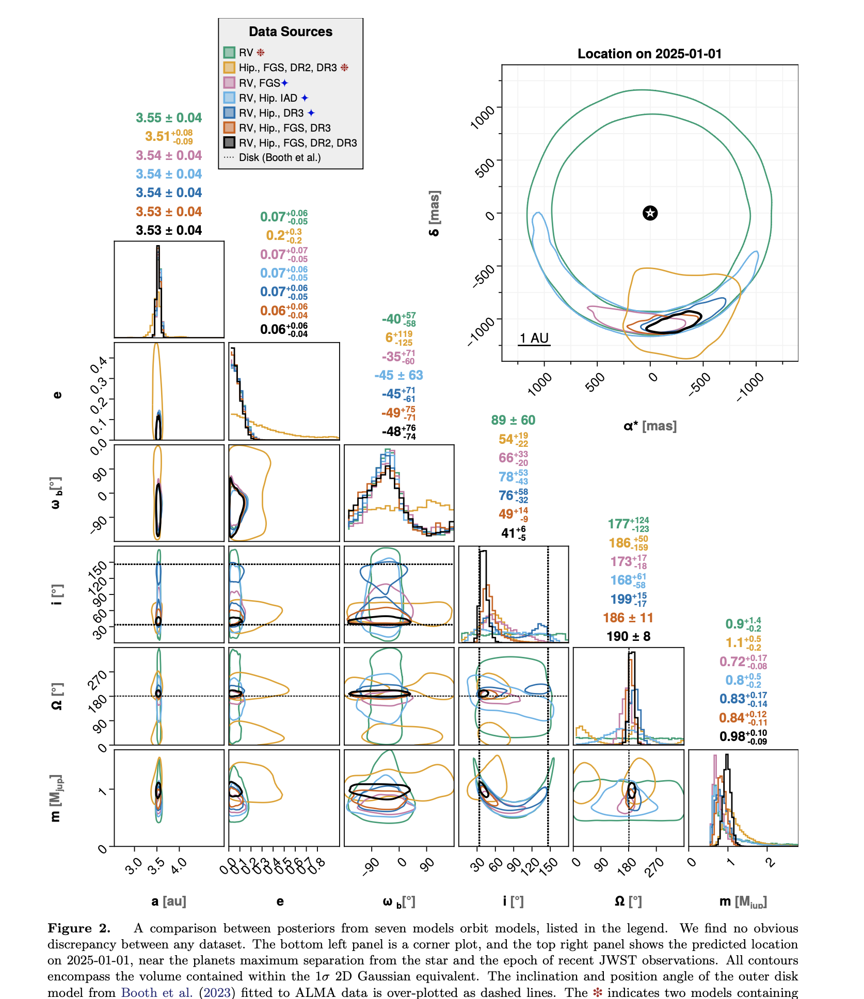
