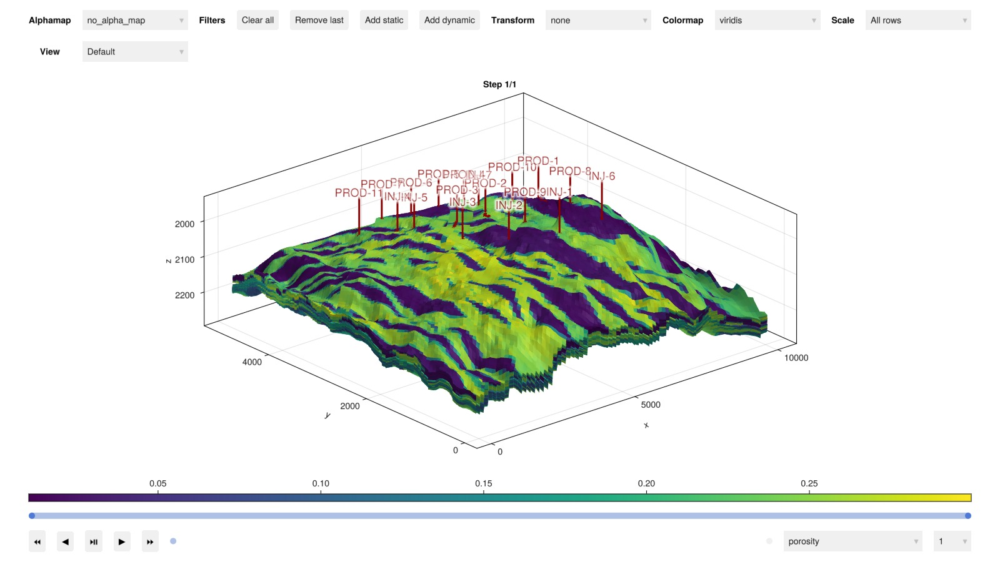

# Makie Showcases

We're excited to feature some great packages utilizing Makie.jl.
From intuitive GUIs and robotic visualizations to interactive apps and dynamic simulation displays, these examples show the wide range of visualizations Makie can bring to any project.
If you're using Makie and would like to be featured in our next blog post, [please contact us](https://makie.org/website/contact)!
Let's dive in and explore some of the latest packages leveraging Makie!

## [VMRobotControl.jl](https://cambridge-control-lab.github.io/VMRobotControl.jl/dev/)

VMRobotControl allows you to build dynamic controllers for your robot as intuitive virtual mechanisms. You design your controller by building a virtual mechanism. You connect the virtual mechanism to the robot through compliant elements (like springs and dampers). The control action is automatically translated to the robot actuators (desired joint forces/torques).

This package is designed for building, simulating and controlling robots using passivity-based controllers represented by virtual mechanisms. This is in the tradition of virtual model control and energy shaping/damping injection. For a defined robot geometry, you can select specific coordinates and connect components to shape the robot dynamic properties. This provides a simple way to program complex robot behaviour incrementally, from mechanical primitives.

## [Sunny.jl](https://sunnysuite.github.io/Sunny.jl/stable/)

Sunny is a package for simulating atomic scale magnetism in real materials. It facilitates specification of a broad class of spin models and includes a diverse suite of numerical solvers. These include powerful methods for simulating spin dynamics both in and out of equilibrium. Uniquely, it generalizes the traditional dynamics of spin dipoles to a dynamics of SU(N) coherent states, which better captures local quantum mechanical effects. Sunny also offers a well-developed framework for calculating the dynamical spin structure factor, enabling direct comparison with scattering experiments. Ease of use is a priority, with Makie-powered GUI tools for interactive symmetry analysis and model visualization. [arXiv:2501.13095](https://arxiv.org/abs/2501.13095)

## [Comodo](https://github.com/COMODO-research/Comodo.jl)

Comodo.jl is a Julia package for computational (bio)mechanics and computational design. Comodo offers a range of geometry processing methods. This included CAD-like operations such as extrusion, revolution, and lofting. Furthermore it offers various surface and volumetric meshing methods, which can be combined with finite element analysis. Together this provides a powerful set of tools allowing users to create frameworks for parameterized and automated design and design optimization. Comodo is currently being extended with image-based modelling methods, such that users may segment medical image data to create surface and volumetric meshes, e.g. for finite element analysis based medical device design optimization.

## [Multibody.jl](https://help.juliahub.com/multibody/dev/#Multibody)

Multibody.jl is a library of model components for ModelingToolkit, an equation-based modeling language. With Multibody.jl, the user can assemble dynamical models for simulation of mechanical systems, such as robots, cars, drive lines and aircraft, by connecting ready-made components such as rods, boxes, joints and wheels.
The modeling-language is responsible for deriving the equations of motion of the assembled model, lifting this burden off the shoulders of the modeler. 3D mechanical modeling benefits greatly from being able to visualize the mechanical system, both during the model-building process and while analyzing the result of a simulation. The interactive features of Makie fits this bill perfectly, allowing the user to produce both animations and interactive renders of their model.

## [Jutul.jl](https://github.com/sintefmath/Jutul.jl)

Jutul.jl is a finite-volume modelling framework based on automatic differentiation for coupled, non-linear partial differential equations that powers several different applications that include Makie extensions for visualization. This includes [BattMo.jl](https://github.com/BattMoTeam/BattMo.jl), a package for fast and differentiable battery simulation and [JutulDarcy.jl](https://github.com/sintefmath/JutulDarcy.jl), a high-performance simulator for flow in porous media discretized on unstructured meshes.

## [EnergyModelsGUI.jl](https://github.com/EnergyModelsX/EnergyModelsGUI.jl)

EnergyModelsGUI is a graphical interface built on top of the [EnergyModelsX](https://github.com/EnergyModelsX/) framework that utilizes Makie for interactive visualizations. It provides clear, intuitive depictions of multi-energy system topologies, input data, and results, making it much easier for users to verify that their system is correctly specified and to understand model outcomes. While it does not allow altering system setups or parameters, it serves as a powerful tool for checking configurations and exploring complex results.

## [GraphPlayground.jl](https://github.com/dgleich/GraphPlayground.jl)

Sometimes the best way to understand data is to play around with it interactively. There is a lovely package in JavaScript to do this by Mike Bostock called d3. In particular, the d3-force library includes all sorts of fun demos. GraphPlayground.jl includes a port of the d3-force library to Julia to enable an interactive graph exploration tool in Makie (via [GraphMakie.jl](https://github.com/MakieOrg/GraphMakie.jl)). It's capable of force calculations (attractions, repulsions, collisions) with tens of thousands of simple objects. I've used it to explore graphs of session conflicts at conferences as well as to generate layouts for small graphs. Given any undirected graph from Graphs.jl, using it is as simple as playground(g) to get an interactive window with labels, the ability to pin nodes, and the ability to export coordinates of the final layout.

## [TempestSDR.jl](https://juliatelecom.github.io/TempestSDR.jl/dev/gui/)

This package proposes a Graphical User Interface (GUI) leveraging Makie to perform real-time screen eavesdrop. Screens are connected to devices by cables, often HDMI or VGA. This can lead to an unwanted emission of the image signal through electromagnetic waves. A passive listener can retrieve the image signal without being in the same room as the targeted PC!

## [PDDLViz.jl](https://github.com/JuliaPlanners/PDDLViz.jl)

PDDLViz.jl is a library for visualizing, animating, and interacting with AI planning domains specified in the Planning Domain Definition Language (PDDL).
PDDLViz.jl is part of the [JuliaPlanners ecosystem](https://github.com/JuliaPlanners), and operates on top of the [PDDL.jl](https://github.com/JuliaPlanners/PDDL.jl) interpreter and compiler for PDDL.
PDDLViz.jl also supports the animation and rendering of planning algorithms and solutions supported by the [SymbolicPlanners.jl](https://github.com/JuliaPlanners/SymbolicPlanners.jl) library.

## [NDViewer](https://github.com/MakieOrg/NDViewer.jl)

NDViewer is an early-stage prototype created by the Makie team at [JuliaEO 2024](https://www.aircentre.org/the-juliaeo-2024-workshop) ([workshop page](https://aircentre.github.io/JuliaEO24/)), aimed at exploring multidimensional datasets.
It supports loading [YAXArrays](https://github.com/JuliaDataCubes/YAXArrays.jl) and most other Julia array types and it uses a simple YAML syntax for defining slices and plots, making it easier to create custom dataset viewers.

Key features include:

- **Runs anywhere**: This can run locally directly on the GPU, while it can also be integrated into any website, to let a wide audience interact with the data.
- **Modular**: Utilizes Makie's plotting capabilities with plug-ins for customizable axes and attributes, making it easy to create very different domain specific viewers.
- **Basic UI**: Offers a straightforward interface for viewing data slices and including a colorbar for context.
- **Data Handling**: Designed to handle large datasets, such as satellite data or neuroimaging, with support for 2D to 4D data.
- **Plug into Makie ecosystem**: Makes it easy to integrate new plot types from other Packages, like [Tyler.jl](https://github.com/MakieOrg/Tyler.jl)

While NDViewer is still in the prototype stage, it lays the groundwork for versatile data visualization and interaction within the Makie framework.
Work on it is currently not funded, if you're interested in this project to succeed, please [contact us](https://makie.org/website/contact) 😊

#### Tyler.jl integration

#### Visualizing a dataset from [SpeedyWeather.jl](https://github.com/SpeedyWeather/SpeedyWeather.jl)

