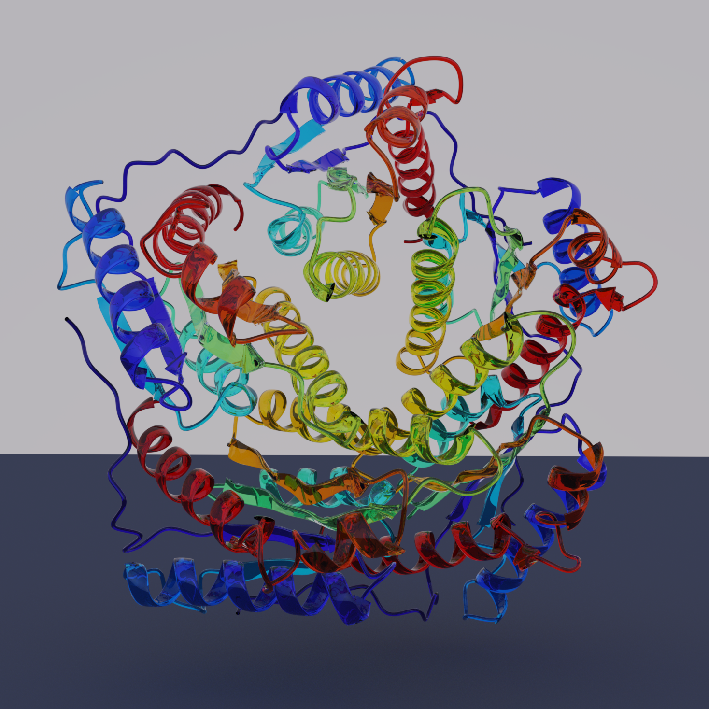
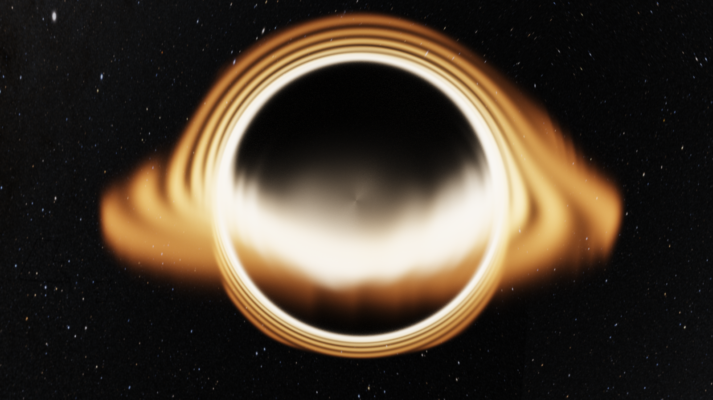

# Ray Tracing in Makie: From Research Data to Photorealistic Renders


We're excited to announce [RayMakie](https://github.com/MakieOrg/RayMakie.jl) and [Hikari](https://github.com/MakieOrg/Hikari.jl), a physically-based GPU ray tracing pipeline integrated directly into [Makie](https://docs.makie.org).
Any Makie scene can now be rendered with photorealistic path tracing: just swap out the backend and get global illumination, volumetric media, spectral rendering, and physically-based materials, all running on the GPU.

All showcase scripts and demo scenes from this post are available at [github.com/SimonDanisch/RayDemo](https://github.com/SimonDanisch/RayDemo).

**Note:** RayMakie, Hikari, and Raycore are not fully released yet — we plan to publish official releases in the coming weeks. In the meantime, the `Project.toml` in [RayDemo](https://github.com/SimonDanisch/RayDemo) will be kept up to date so you can already try things out.

## Why Ray Tracing in Julia?

Research groups across many fields (climate science, structural biology, fluid dynamics, particle physics) produce complex 3D data that needs to be communicated clearly and compellingly.
Photorealistic rendering can transform dense simulation output into images that reveal structure and tell a story. But getting research data into a traditional ray tracer usually means exporting meshes, learning new tools, and losing the interactive workflow.

By building ray tracing directly into Makie, we eliminate that gap. The same scene you explore interactively with GLMakie can be rendered photorealistically with RayMakie, no export step, no new API to learn.

Writing the implementation in Julia gives us:

- **Performance**: Julia compiles to efficient GPU code, competitive with C++ ray tracers
- **Cross-vendor GPU support**: A single codebase runs on AMD, NVIDIA, and CPU via [KernelAbstractions.jl](https://github.com/JuliaGPU/KernelAbstractions.jl)
- **Makie integration**: The familiar Makie API for scene construction, camera control, and lighting, with ray tracing as a drop-in rendering option
- **Modular architecture**: Custom materials, media, and integrators run directly on the GPU through Julia's multiple dispatch, opening up novel visualization and simulation use cases
- **Hackability**: A state-of-the-art spectral path tracer in a high-level language makes ray tracing research and experimentation accessible to a much wider audience

## How It Works

Hikari is a Julia port of [pbrt-v4](https://pbrt.org/), the reference implementation from *Physically Based Rendering* (Pharr, Jakob, Humphreys). It implements a wavefront volumetric path tracer with spectral rendering, supporting participating media (NanoVDB, grid-based volumes), physically-based materials (metals, dielectrics, coated surfaces), and environment/sun-sky lighting. The ray intersection engine lives in [Raycore.jl](https://github.com/JuliaGeometry/Raycore.jl), a standalone package factored out of Hikari and based on AMD's [Radeon Rays SDK](https://github.com/GPUOpen-LibrariesAndSDKs/RadeonRays_SDK) and [HIPRT](https://gpuopen.com/hiprt/).

RayMakie connects Hikari to Makie's scene graph. You build a scene with standard Makie calls (`mesh!`, `surface!`, `volume!`, `meshscatter!`), set materials and lights, then render:

```julia
# no-eval
using RayMakie, Hikari

scene = Scene(size=(1920, 1080), lights=[SunSkyLight(Vec3f(1, 2, 8))])
cam3d!(scene)
mesh!(scene, my_mesh; material=Hikari.Gold(roughness=0.1))

img = colorbuffer(scene;
    device=AMDGPU.ROCBackend(),  # or CUDABackend(), CPU()
    integrator=Hikari.VolPath(samples=100, max_depth=12),
    sensor=Hikari.FilmSensor(iso=100, white_balance=6500),
)
```

## Showcases

### Breeze: Volumetric Cloud Rendering

[Breeze.jl](https://github.com/NumericalEarth/Breeze.jl/) generates cloud fields from Large Eddy Simulations powered by [Oceananigans.jl](https://github.com/CliMA/Oceananigans.jl), a GPU-accelerated ocean and atmosphere simulator developed at MIT's Climate Modeling Alliance (CliMA).
The demo renders BOMEX cumulus clouds as photorealistic volumetric media, using NanoVDB sparse grids for efficient storage and Hikari's volumetric path tracing for physically-accurate light scattering through the cloud medium.


The terrain demo combines real elevation data from ArcGIS (via [Tyler.jl](https://github.com/MakieOrg/Tyler.jl)) with BOMEX cloud volumes, inspired by [rayshader](https://www.rayshader.com/).


> Makie-Oceananigans integration has been a major initiative over the past year. The ray tracing work with Breeze is truly groundbreaking in my opinion. It may be crucial for science, for inspecting the structure of clouds and thunderstorms. It also has the potential to lead to commercial products.
>
> **Gregory Wagner**, Research Scientist at MIT and CliMA (Climate Modeling Alliance), lead developer of Oceananigans.jl and Breeze.jl

### PlantGeom: Digital Twins for Agriculture

[PlantGeom.jl](https://github.com/VEZY/PlantGeom.jl) renders biophysically accurate 3D plant models for agricultural research.
The ray-traced oil palm uses coated diffuse transmission materials to simulate the waxy leaf cuticle and subsurface light transport through leaf tissue.


> Makie has become a central part of my daily scientific workflow. The fact that a single plotting ecosystem can cover the entire spectrum from high-performance 3D scenes to publication-ready figures is just exceptional. Several of the packages I develop would simply not exist in their current form without Makie. My research focuses on developing plant-scale digital twins to study complex agricultural systems (agroforestry, species mixtures, agrivoltaics) with the goal of understanding crop responses to climate and contributing to food security and climate-change adaptation. The recent work on ray tracing is especially exciting: beyond rendering, I am planning to use RayCore.jl for scientific applications such as computing radiation interception in plant canopies, which enables organ-scale energy balance calculations (latent and sensible heat fluxes) and photosynthesis modeling. Understanding how plant shadows affect heat transfer is crucial for adapting agriculture to extreme heat events. Makie has been a genuine force multiplier for my research.
>
> **Remi Vezy**, CIRAD, developer of PlantGeom.jl

### ProtPlot: Protein Structure Visualization

[ProtPlot.jl](https://github.com/MurrellGroup/ProtPlot.jl) renders protein ribbon diagrams with physically-based materials.
Different materials reveal different aspects of the structure: glass refractions show the interior ribbon path, while a coated diffuse surface with shallow depth of field draws attention to specific regions of the fold. Specular highlights, ambient occlusion, and defocus blur make spatial relationships immediately clear in a way that flat shading cannot.

| Glass | Coated Diffuse with Depth of Field |
|:---:|:---:|
|  |  |

ProtPlot also powers animated visualizations of protein folding trajectories, the transport process that generative models learn to perform. Ray tracing makes the spatial relationships in these animations immediately legible. The code to produce this is almost entirely standard Makie and ProtPlot, only the imports and a few rendering parameters change:

```julia
# no-eval
using RayMakie, ProtPlot, Hikari, AMDGPU

device = AMDGPU.ROCBackend()

tracks = readdir("Trajectories/samp_00015", join=true)
set_theme!(lights=[
    Makie.SunSkyLight(Vec3f(0.4, -0.3, 0.7);
        intensity=1.0f0, turbidity=3.0f0, ground_enabled=false),
])
ProtPlot.animate_molecule_dir("trajectory.mp4", tracks)
```

The `animate_molecule_dir` function is pure ProtPlot code, building Makie figures with `Axis3`, `atomplot!`, and `ribbon!` as usual. RayMakie intercepts the `record` call and path-traces each frame automatically.


> My lab is working on new kinds of generative models, primarily for protein structures. These work by specifying a process that transports randomly sampled noise to a biophysically plausible protein structure, and training a deep neural network to learn how to do this. But the details of this transport process are critical and, while you can to some extent mathematically reason about it, there is no substitute to being able to actually see it in action, both when you're designing it and when investigating how well the model has actually learned it. We rely entirely on Makie for this. These are not just for our internal use, but can be valuable for communicating how the methods work. Developments like raytracing will allow us to configure these to show exactly the details we seek to communicate without them getting buried in the complexity.
>
> **Ben Murrell**, Karolinska Institutet, developer of ProtPlot.jl

### TrixiParticles: Fluid Simulation

[TrixiParticles.jl](https://github.com/trixi-framework/TrixiParticles.jl) simulates fluid dynamics with smoothed particle hydrodynamics.
The water splash demo renders SPH surface meshes with glass materials (IOR 1.33). Fresnel reflections and refractions create the characteristic look of water without any post-processing. The animation shows a gold ball dropping into water, with each frame independently path-traced:


> Native raytracing in Makie would let us move some of our workflows entirely into Julia, from simulation to publication-ready figures, without relying on external tools.
>
> **Dr. Michael Schlottke-Lakemper**, University of Stuttgart, lead developer of TrixiParticles.jl

### Volumetric Rendering: Clouds, Smoke, and Exhaust Plumes

Participating media are first-class citizens in Hikari's path tracer. Light scatters through volumes realistically, no billboard tricks or screen-space approximations. Hikari supports two volume representations: **NanoVDB** sparse grids for large-scale data (like the cloud simulations above), and **RGBGridMedium** for dense grids with per-voxel color, emission, and scattering properties. Both integrate directly with Makie's `volume!` plot or can be attached to any mesh as a `MediumInterface`.

The **Stanford bunny cloud** from the [pbrt-v4 test scenes](https://github.com/mmp/pbrt-v4-scenes), rendered with NanoVDB and Henyey-Greenstein phase function scattering:


A **sphere wake** from [WaterLily.jl](https://github.com/WaterLily-jl/WaterLily.jl) LES simulation, visualized as volumetric smoke. The volume density is updated in-place each frame via `RGBGridMedium` with a colormap, so the scene never needs to be rebuilt:


The **HL-20 spacecraft** (model provided by [JuliaHub](https://juliahub.com)) with a procedurally generated emissive rocket exhaust plume. `RGBGridMedium` with per-voxel emission creates the blue-white core fading to orange at the edges:


### GLTF Models: Emissive Textures and Scene Composition

RayMakie loads GLTF/GLB models and automatically maps their PBR materials to Hikari equivalents. Emissive texture maps create area lights that both glow and illuminate the scene. The Christmas tree decorations below are lit entirely by their own emissive maps; the quadcopter model was provided by [JuliaHub](https://juliahub.com):


### Geant4: Particle Detector Visualization

[Geant4.jl](https://github.com/JuliaHEP/Geant4.jl) provides Julia bindings to the CERN Geant4 particle physics simulation toolkit. The CMS (Compact Muon Solenoid) detector at CERN is one of the largest and most complex scientific instruments ever built. RayMakie can load the full detector geometry from GDML files, apply a quadrant cut to reveal internal structure, and render the result with physically-based metal materials (gold, copper, silver, aluminum, iron).

| | |
|:---:|:---:|
|  |  |

The detector meshes are generated from Geant4's tessellated polyhedra with crease-angle vertex splitting for smooth normals on curved barrel surfaces while preserving hard edges at structural boundaries.

### Black Hole: Custom GPU Materials

One of the most powerful aspects of building a ray tracer in Julia is that users can define entirely new physics by subtyping `Hikari.Medium`. The black hole demo demonstrates this: a custom `SpacetimeMedium` struct implements gravitational lensing by overriding `Hikari.apply_deflection` to bend light rays according to the Schwarzschild metric. The accretion disk is an emissive volumetric density field with temperature-dependent coloring, hotter near the event horizon, cooler at the outer edge.

Because Julia's multiple dispatch compiles these custom methods directly into the GPU kernels alongside the built-in materials, there is no performance penalty for user-defined physics. The same wavefront path tracer handles standard glass and metals alongside relativistic spacetime curvature.



The black hole can also be explored interactively. RayMakie's interactive mode progressively refines the path-traced image while you move the camera in real time:


An overlay renderer composites rasterized elements (lines, text, wireframes) on top of the ray-traced image, so Makie's standard 2D overlays like legends, colorbars, and annotations work alongside path tracing. The interactive window can also target individual subscenes and axes, so you can place a ray-traced view next to other plots in a GLMakie figure.

## Getting Started

RayMakie is available as a Makie backend. To render any existing Makie scene with ray tracing:

```julia
# no-eval
using RayMakie, Hikari

# Build your scene with standard Makie
scene = Scene(size=(800, 600), lights=[SunSkyLight(Vec3f(1, 2, 8))])
cam3d!(scene)
mesh!(scene, my_geometry; material=Hikari.Gold())

# Render with path tracing
img = colorbuffer(scene;
    device=AMDGPU.ROCBackend(),
    integrator=Hikari.VolPath(samples=100, max_depth=12),
)
```

For interactive exploration, use `RayMakie.interactive_window` to progressively refine the image while adjusting the camera in real time.

## Future Work

- **Memory optimizations**: GPU memory is currently allocated eagerly and not released early, making it easy to run out of VRAM on complex scenes. We plan to implement early release of intermediate GPU buffers and more careful memory management. We also can still improve packing and our struct sizes and test that we dont do unecessary allocations.
- **Performance optimizations**: While rendering is already fast, there is significant room for optimization in BVH construction, batching ray intersections, kernel occupancy, and data layout.
- **Code quality and Makie integration**: The current implementation is a solid prototype, but needs cleanup and full integration of experimental features. Some internal code paths and the Makie backend interface need improvement.
- **SPPM for caustics**: Stochastic Progressive Photon Mapping was removed and deprioritized, but we would like to bring caustic rendering back in the future.
- **GPU backend testing**: Currently only AMD GPUs (via AMDGPU.jl) are fully tested and guaranteed to work well. NVIDIA support via CUDA.jl should work but needs more testing. The CPU backend still has allocation issues that are likely a Julia-level bug requiring further investigation.
- **Makie tests** We still need to port the whole Makie test suite with reference tests, right now tests are minimal and no visual regression tests.

## Acknowledgments

Hikari is a Julia port of [pbrt-v4](https://pbrt.org/) by Matt Pharr, Wenzel Jakob, and Greg Humphreys.
It builds on [Trace.jl](https://github.com/JuliaGraphics/Trace.jl), originally created by [Anton Smirnov](https://github.com/pxl-th), and on the [Raycore.jl](https://github.com/JuliaGeometry/Raycore.jl) intersection engine.
GPU support is powered by [KernelAbstractions.jl](https://github.com/JuliaGPU/KernelAbstractions.jl) and the Julia GPU ecosystem.
The quadcopter and HL-20 spacecraft GLTF models were provided by [JuliaHub](https://juliahub.com).

This work was made possible by an investment of the [Sovereign Tech Agency](https://www.sovereign.tech).

Some of the optimization and GPU work on Raycore has been funded by [Muon Space](https://www.muonspace.com/).
