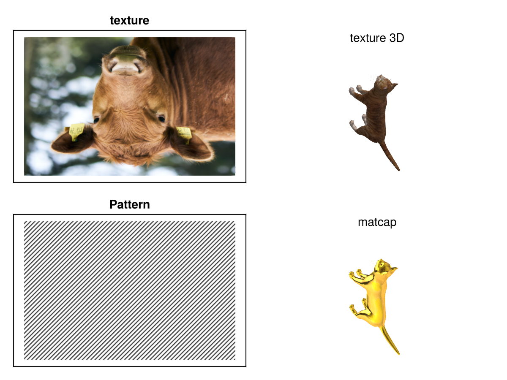
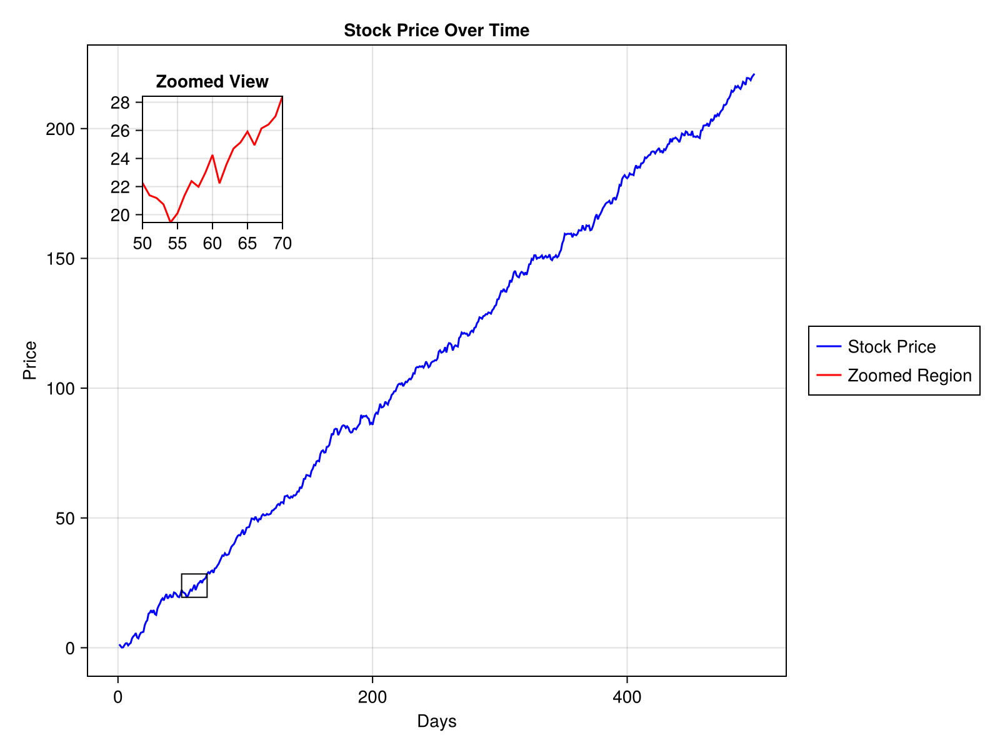
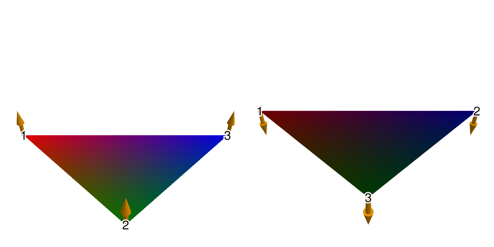
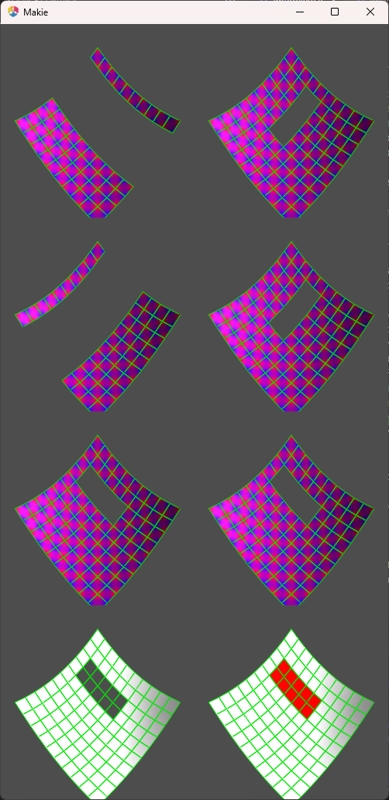

# Makie v0.22.2

Makie 0.22.2 is finally here and introduces many fixes and improvements.

## [Cleanup Patterns/Hatching](https://github.com/MakieOrg/Makie.jl/pull/4715)

We have improved the support for patterns. We added tests and fixed various issues we found along the way. Patterns should now work more consistently across plot types and backends. We also improved the line rendering for `LinePattern` and anchored patterns to plot coordinates to improve the visual quality. If you are not yet aware of patterns you can now read up on them as well other texture-like color options in the [updated color documentation](https://docs.makie.org/dev/explanations/colors#Textures,-Patterns-and-MatCaps).

## [Nudge Axis3 clip planes to avoid clipping at 0 margin](https://github.com/MakieOrg/Makie.jl/pull/4742)

When we updated `Axis3` to feature zooming and translation controls we also added clipping at the axis boundary. If a plot element sits right at the boundary, e.g. due to setting margins to 0, they would sometimes get clipped and sometimes not. To avoid this, we moved the clip planes slightly outside the axis. As noted below we also added the option to completely turn off clipping in a separate pull request.

| v0.22 | v0.22.2 |
| --- | --- |
|  |  |

## [Added a tutorial on creating an inset plot](https://github.com/MakieOrg/Makie.jl/pull/4697)

Introduced a [tutorial](https://docs.makie.org/dev/tutorials/inset-plot-tutorial#Creating-an-Inset-Plot) explaining how to create inset plots. Mention the [zoom_lines](https://juliaaplavin.github.io/MakieExtraDocs.jl/notebooks/examples.html#3526c688-aea9-411b-a837-dc02ff81a7ee) function from [MakieExtras.jl](https://github.com/JuliaAPlavin/MakieExtra.jl) for connecting inset plots.

## [Add documentation on mesh normal generation](https://github.com/MakieOrg/Makie.jl/pull/4787)

[Documented](https://docs.makie.org/dev/reference/plots/mesh#Simple-mesh-plots) how vertex order affects normal generation in mesh plots, providing clarity on how different vertex arrangements can impact plot appearance.

## [Cleanup volume](https://github.com/MakieOrg/Makie.jl/pull/4726)

We addressed discrepancies in volume plot algorithms between GLMakie and WGLMakie and added more detailed documentation and tests for volume rendering. We fixed an issue with `:mip` truncating values at `0`, fixed `RGBA` algorithms not accepting `RGBA` data and connected the `absorption` keyword to `:absorptionrgba` and `:indexedabsorption`.

## [Improve nan handling in surface plots](https://github.com/MakieOrg/Makie.jl/pull/4735)

We improved handling of NaN values in surface plots, ensuring consistency across different backends and updated reference images to reflect these changes. Specifically we are now treating NaNs in positions as invalid data, resulting in the relevant vertices being cut instead of defaulting to 0.

| v0.22 | v0.22.2 |
| --- | --- |
|  |  |

## [DPI metadata for png](https://github.com/MakieOrg/Makie.jl/pull/4812)

Added DPI metadata to PNG files, allowing external applications to interpret and display images at the correct size specified by their px_per_unit setting.

## Voxel improvements

In [#4758](https://github.com/MakieOrg/Makie.jl/pull/4758) we changed how textures are handled by `voxels`. They now rely on `uv_transform` instead of `uvmap` which gives you further control about texture coordinates. For example, it allows you to rotate the texture. The texture coordinates generated for the different voxel sides have changed to be more consistent with expectation, see [the texture mapping documentation](https://docs.makie.org/stable/reference/plots/voxels#Texture-maps). We also adjusted texture coordinates to scale with `gap` so that voxels remain fully covered by the texture they are assigned.

Beyond that we have some smaller fixes:

* Fixed an issue with voxels not rendering on linux with firefox [#4756](https://github.com/MakieOrg/Makie.jl/pull/4756).
* Fixed an issue causing voxel planes to shift when using `rotate!(plot, ...)` [#4824](https://github.com/MakieOrg/Makie.jl/pull/4824)
* Fixed `uv_transform = :rotr90` and `:rotl90` being swapped [#4758](https://github.com/MakieOrg/Makie.jl/pull/4758)

| v0.22 | v0.22.2 |
| --- | --- |
|  |  |

## [Curvilinear `contourf`](https://github.com/MakieOrg/Makie.jl/pull/4744)

Enabled curvilinear `contourf` plots by allowing contour calculations to be dispatched on and transforming Isoband output using bilinear interpolation.

## [Fix broken `voronoiplot` for clipped tessellations](https://github.com/MakieOrg/Makie.jl/pull/4740)

Resolved an issue with `voronoiplot` to work correctly with clipped tessellations and automatic color generation which was previously causing errors.

## [Add option to turn off clipping](https://github.com/MakieOrg/Makie.jl/pull/4791)

We introduced a feature that allows users to disable clipping in `Axis3` by setting `ax.clip[] = false`. Note that you could already do this on a per-plot basis by overwriting the `clip = Plane3f[]` attribute when creating a plot.

## [Resolve :data space when deciding whether to connect transformations](https://github.com/MakieOrg/Makie.jl/pull/4723)

When a plot is created its transformations, i.e. the `transform_func` (for example the `log` transform of an Axis) and model transformations (as set by `scale!()`, `rotate!()` and `translate!()`) are inherited from its parent based on whether their `space` is compatible. This only used to check the direct parent, which created a problem when `space = :data` represented pixel, clip or relative space through a pixel, empty or relative camera. We now trace the space up to the parent scene to resolve this issue.

## [Improvements for Slider updates](https://github.com/MakieOrg/Makie.jl/pull/4748)

Added options to slider updates, including `update_while_dragging` and `throttle`, and introduced `lowres_background` to the `Resampler` to optimize performance when updating `heatmap(Resampler(data))` often.

## Internal fixes for (W)GLMakie

* Fix rare shader compilation error[#4755](https://github.com/MakieOrg/Makie.jl/pull/4755)
* [Upgrade to threejs 0.173, fixing a rare problem with NaNs in buffers](https://github.com/MakieOrg/Makie.jl/pull/4809)
* Fix WGLMakie nan error in cut plane, which broke Axis3 [#4772](https://github.com/MakieOrg/Makie.jl/pull/4772)
* fix UInt underflow in line indices [#4782](https://github.com/MakieOrg/Makie.jl/pull/4782)

## [Allow higher dimensional geometries in poly](https://github.com/MakieOrg/Makie.jl/pull/4738)

Restored support for rendering higher-dimensional geometries with the `poly()` function, enabling 3D shape visualization as a mesh with outlines.

## [allow setting inspectable in the theme](https://github.com/MakieOrg/Makie.jl/pull/4739)

Enabled setting the `inspectable` attribute within themes, allowing for theme-wide customization of inspectability options across plots.

## [Allow `Block.attri...` to autocomplete](https://github.com/MakieOrg/Makie.jl/pull/4786)

We added support for autocompletion for attributes on Block types. This allows you to tab-complete attributes while looking for documentation, e.g. `?Axis.xl` will complete to `?Axis.xlabel`.

## [Consider visible in PolarAxis protrusions](https://github.com/MakieOrg/Makie.jl/pull/4823)

Fixed an issue where PolarAxis protrusions did not consider visibility states, e.g. due to being hidden by `hidedecorations!(ax)`.

## [Widget optimizations](https://github.com/MakieOrg/Makie.jl/pull/4821)

Optimized widget updates by reducing redundant updates, and by removing `pick()` usage where possible.
This solves a rare issue, where `Textfield` would stop working on a server with higher latency.

## [Fix WGLMakie tick and window_open events](https://github.com/MakieOrg/Makie.jl/pull/4818)

We fixed an issue causing tick events to not be spawned in WGLMakie and connected the window_open event. This also fixes issues with animated Widgets, e.g. Toggle not working in WGLMakie.
