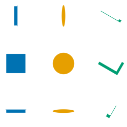

# Makie v0.23.0

Makie 0.23.0 is a relatively small breaking release before the big 0.24.0 ComputePipeline refactor. It's only breaking change is the `arrows()` refactor.

## Arrows

Arrows have been refactored to address a number of issues, most importantly issues with scaling and alignment.
Before 0.23 `arrows` did not consider the arrow tip as part of the length, which meant that arrows were always longer than they should be.
When aligning to their tip, they actually aligned to the endpoint of the shaft (called tail pre 0.23) instead.

The new `arrows2d` and `arrows3d` now strictly follow the rule that the final arrow length must match the length derived from `directions`, `normalize` and `lengthscale`.
The arrows may stretch their shaft or scale as a whole to achieve this.

```julia
using CairoMakie
CairoMakie.activate!()

f = Figure(size = (600, 300))
hlines(f[1, 1], [0, 0.2, 2, 5])
arrows2d!(1:3, zeros(3), zeros(3), [0.2, 2, 5])
hlines(f[1, 2], [0, 0.2, 2, 5])
arrows3d!(1:3, zeros(3), zeros(3), [0.2, 2, 5], markerscale = 1)
f
```

As you can see short arrows shrink while long arrows get a longer shaft.
This is controlled by `minshaftlength` and `maxshaftlength`.
If the calculated shaftlength falls in this range, the shaft is scaled to that length.
If it does not, the length is clamped to that range and the full arrow is scaled instead.
If you want just shaftlength scaling you can set `minshaftlength = 0`.
(Scaling will still happen if the shaftlength drops to 0.)
If you want just scaling, you can set `shaftlength` to a fixed value.

```julia
using CairoMakie
CairoMakie.activate!()

f = Figure(size = (600, 300))
hlines(f[1, 1], [0, 0.2, 2, 5])
arrows2d!(1:3, zeros(3), zeros(3), [0.2, 2, 5], minshaftlength = 0)
a, p = hlines(f[1, 2], [0, 0.2, 2, 5])
arrows2d!(1:3, zeros(3), zeros(3), [0.2, 2, 5], shaftlength = 20)
xlims!(a, 0.9, 3.8)
f
```

The styling attributes `arrowsize`, `linewidth`, `arrowtail` and `arrowhead` have been broken up and renamed.
There are now three components to an arrow, the (usually 0 length) tail, shaft and tip.
Each have a length and width (2D) or radius (3D).
In 2D they are given in `markerspace`, i.e. pixel space by default.
Unlike before they are not necessarily the true size of the final arrow, as scaling can still apply.
In 3D they are given in a boundingbox relative space if `markerscale = automatic` (default), or in data units scaled by `markerscale` if its is set to a number.
The tail, shaft and tip can each be set to a vector of points (2D) or mesh to change the look of the arrows.


The total arrow length follows from the `direction` argument, `lengthscale` and `normalize`.
If `normalize = true` directions are normalized first.
Then they are multiplied by `lengthscale`.
The result is target length of the arrow, which the drawn arrow marker must be equal to.

```julia
using CairoMakie
CairoMakie.activate!()

f,a,p = arrows2d(1:3, fill(0, 3), zeros(3), [0.2, 0.5, 1])
arrows2d!(1:3, fill(2, 3), zeros(3), [0.2, 0.5, 1], normalize = true)
arrows2d!(1:3, fill(4, 3), zeros(3), [0.2, 0.5, 1], lengthscale = [5, 1, 0.2])
arrows2d!(fill(4, 3), [0, 2, 4], zeros(3), [0.2, 0.5, 1], taillength = 10)
f
```

The `align` attribute has been reduced to only accepting `:tail`, `:center`, `:tip` or a number.
`:tail` (0) and `:tip` (1) are the two endpoints of the arrow and `:center` (0.5) is the center of full arrow.
Note that you can also create a gap by setting `align` to a value outside the 0..1 range.

```julia
using CairoMakie
using Makie.GeometryBasics
CairoMakie.activate!()

ps = Makie.coordinates(Rect2f(-1, -1, 2, 2))
f = Figure(size = (600, 300))
scatter(f[1, 1], ps, markersize = 20)
arrows2d!(ps, ps, align = :center, lengthscale = 0.3)

scatter(f[1, 2], ps, markersize = 20)
arrows2d!(ps, ps, align = :tail, lengthscale = 0.3, color = :orange)
arrows2d!(ps, ps, align = 1.2, lengthscale = 0.3, color = :blue)

tail = Point2f[(0, 0), (1, -0.5), (1, 0.5)]
arrows2d!(
    ps, [ps[2:end]; ps[1:1]], argmode = :endpoint,
    align = :center, lengthscale = 0.8, color = :green,
    tail = tail, taillength = 8
)

f
```

Another addition is `argmode` which allows you to change the interpretation of the second argument.
With `argmode = :endpoint` the second argument is treated as as the target position for the tip.
The directions are then derived from that, with `normalize` and `lengthscale` applying afterwards.
`align` works a bit different in this mode.
Instead of aligning a fraction of the final arrow with origin (first argument), it aligns that fraction with the same fraction between the endpoints.
So with `align = :center`, the center of the arrow aligns with center of the two endpoints.

All of these concepts also apply to `arrows3d`:

```julia
using GLMakie
using GLMakie.GeometryBasics
GLMakie.activate!()

f = Figure(size = (500, 500))
ax = Axis3(f[1, 1], aspect = :data)

r = Rect3f(-1, -1, -1, 2, 2, 2)
ps = coordinates(r)
meshscatter!(ps, color = :white)
arrows3d!(ps, ps, align = -0.2, tipcolor = :yellow, shaftcolor = :lightblue, lengthscale = 0.5)

tail = Makie.Cone(Point3f(0,0,1), Point3f(0), 0.5)
startstop = Makie.convert_arguments(LineSegments, r)[1]
arrows3d!(
    startstop[1:2:end], startstop[2:2:end], argmode = :endpoint,
    align = 0.5, lengthscale = 0.8,
    tail = tail, taillength = 0.4, tailcolor = :red,
    markerscale = 0.5,
    color = :orange
)

f
```

Note that `arrows2d` and `arrows3d` can both be used in 2D and 3D space.
They differ in how they represent arrows - as a 2D mesh or a 3D mesh respectively.
Note as well that we introduced `Cone(origin, extremity, radius)` as a GeometryPrimitive in `GeometryBasics` with this release.

[#4925](https://github.com/MakieOrg/Makie.jl/pull/4925)

## Dendrogram

We have (finally) added the `dendrogram` recipe.
Given a collection of leaf node positions and merge indices, a tree visualization is created.

```julia
using CairoMakie
CairoMakie.activate!()

# node positions and indices of pairs that merge
ps = Point2f.(1:8, 0)
merges = [(i, i+1) for i in 1:2:13]

f,a,p = dendrogram(ps, merges)

dendrogram(
    f[2,1], ps, merges, groups = [1, 1, 1, 1, 2, 2, 3, 3],
    colormap = [:red, :green, :blue], linewidth = 3,
    branch_shape = :tree, rotation = :up
)

ax = PolarAxis(f[1:2,2:3])
cs = vcat(fill(:black, 8), fill(:green, 4), fill(:orange, 2), fill(:red, 1))
p = dendrogram!(ax, ps, merges, color = cs, width = 2pi - 2pi/9, linewidth = 5)
node_ps = Makie.dendrogram_node_positions(p)
textlabel!(
    ax, node_ps, text = string.(1:15), shape = Circle(Point2f(0), 1),
    shape_limits = Rect2f(-1,-1,2,2), keep_aspect = true
)
rlims!(ax, 0, 3.5)

f
```

[#2755](https://github.com/MakieOrg/Makie.jl/pull/2755)

# Backlog

## Makie 0.22.8

### Annotation

There's a new `annotation` recipe which can be used to annotate data points with text labels and connecting arrows or other styles. If no specific label positions or offsets are given, the default behavior tries to move labels away from data points, other labels and the figure boundary. This results in better readability for quick plots compared to a simple `text` annotation:

```julia
using CairoMakie
CairoMakie.activate!()

f = Figure()

points = [(-2.15, -0.19), (-1.66, 0.78), (-1.56, 0.87), (-0.97, -1.91), (-0.96, -0.25), (-0.79, 2.6), (-0.74, 1.68), (-0.56, -0.44), (-0.36, -0.63), (-0.32, 0.67), (-0.15, -1.11), (-0.07, 1.23), (0.3, 0.73), (0.72, -1.48), (0.8, 1.12)]

fruit = ["Apple", "Banana", "Cherry", "Date", "Elderberry", "Fig", "Grape", "Honeydew",
          "Indian Fig", "Jackfruit", "Kiwi", "Lychee", "Mango", "Nectarine", "Orange"]

limits = (-3, 1.5, -3, 3)

ax1 = Axis(f[1, 1]; limits, title = "text")

scatter!(ax1, points)
text!(ax1, points, text = fruit)

ax2 = Axis(f[1, 2]; limits, title = "annotation")

scatter!(ax2, points)
annotation!(ax2, points, text = fruit)

hidedecorations!.([ax1, ax2])

f
```

Annotation labels can be placed either in data space or relative to the target points in screen space, which makes it easy to achieve a consistent visual result regardless of axis scaling:

```julia
using CairoMakie
CairoMakie.activate!()

g(x) = cos(6x) * exp(x)
xs = 0:0.01:4
ys = g.(xs)

f, ax, _ = lines(xs, ys; axis = (; xgridvisible = false, ygridvisible = false))

annotation!(ax, 1, 20, 2.1, g(2.1),
    text = "(1, 20)\nlabelspace = :data",
    path = Ann.Paths.Arc(0.3),
    style = Ann.Styles.LineArrow(),
    labelspace = :data
)

annotation!(ax, -100, -100, 2.65, g(2.65),
    text = "(-100, -100)\nlabelspace = :relative_pixel",
    path = Ann.Paths.Arc(-0.3),
    style = Ann.Styles.LineArrow()
)

f
```

Annotations can come in a variety of styles which will also be expanded in the future. Currently, lines and arrows of different shapes are supported:

```julia
using CairoMakie
CairoMakie.activate!()

fig = Figure()
ax = Axis(fig[1, 1], yautolimitmargin = (0.3, 0.3), xgridvisible = false, ygridvisible = false)

scatter!(ax, fill(0, 4), 0:-1:-3)
annotation!(-200, 0, 0, 0, path = Ann.Paths.Line(), text = "Line()")
annotation!(200, 0, 0, -1, path = Ann.Paths.Arc(height = 0.1), text = "Arc(height = 0.1)")
annotation!(-200, 0, 0, -2, path = Ann.Paths.Arc(height = 0.3), text = "Arc(height = 0.3)")
annotation!(200, 30, 0, -3, path = Ann.Paths.Corner(), text = "Corner()")

annotation!(-200, 0, 0, -5, style = Ann.Styles.Line())
annotation!(-200, 0, 0, -6, style = Ann.Styles.LineArrow())
annotation!(-200, 0, 0, -7, style = Ann.Styles.LineArrow(head = Ann.Arrows.Head()))
annotation!(-200, 0, 0, -8, style = Ann.Styles.LineArrow(tail = Ann.Arrows.Line(length = 20)))

fig
```

[#4891](https://github.com/MakieOrg/Makie.jl/pull/4891)

## Makie 0.22.5

### Legend entries for mesh, meshscatter, image, heatmap and surface plots

`Legend` now has entry visualizations for mesh, meshscatter and surface in 3D and image and heatmap in 2D.

```julia
using GLMakie
GLMakie.activate!()

f = Figure(size = (400, 400))
a,p = heatmap(f[1, 1:2], sin.(1:10)' .* sin.(1:10), label = "Heatmap")
image!(10.5..20.5, 0.5..10.5, sin.(1:10)' .* sin.(1:10), label = "Image")
axislegend(a)

a,p = meshscatter(f[2, 1], [rand(Point3f) + Vec3f(0,0,1) for i in 1:10] , label = "MeshScatter" => (color = :orange,))
mesh!(Rect3f(0,0,0,1,1,1), label = "Mesh" => (color = :lightblue,))
surface!(-1..2, -1..2, sin.(1:10)' .* sin.(1:10), label = "Surface")
Legend(f[2, 2], a, tellwidth = false)
f
```

[#4924](https://github.com/MakieOrg/Makie.jl/pull/4924)

### Hide/show interaction for Legend

You can now toggle the visibility of plots by left clicking their respective `Legend` entries.
Right clicking will toggle all connected plots and middle clicking will synchronize and toggle them

TODO: animation

[#2276](https://github.com/MakieOrg/Makie.jl/pull/2276)

### PolarAxis Ticks

PolarAxis now supports `ticks` (lines between tick labels and the axis frame).
The related attributes are `r-`, `rminor-`, `theta-` and `thetaminor-`:
- `-ticksvisible`: Are ticks shown (default false)
- `-ticksize`: Controls the length of ticks
- `-tickwidth`: Controls the width of ticks
- `-tickcolor`: Controls the color of ticks
- `-ticksmirrored`: Swaps the tick location to the opposite end of the PolarAxis if hte PolarAxis doesn't span a full circle (`rmin > 0` or `thetamax - thetamin < 2pi`)
- `-tickalign`: Controls the alignment of ticks relative to the frame. (default 0, point outwards)

```julia
using CairoMakie
CairoMakie.activate!()

f = Figure(size = (800, 400))
kwargs = (
    rticksvisible = true, rticksize = 12, rtickwidth = 4, rtickcolor = :red, rtickalign = 0.5,
    thetaticksvisible = true, thetaticksize = 12, thetatickwidth = 4, thetatickcolor = :blue, thetatickalign = 0,
    rminorticksvisible = true, rminorticksize = 8, rminortickwidth = 3, rminortickcolor = :orange, rminortickalign = 1.0,
    thetaminorticksvisible = true, thetaminorticksize = 8, thetaminortickwidth = 3, thetaminortickcolor = :cyan, thetaminortickalign = 1.0,
)
a = PolarAxis(f[1,1], title = "normal", rticksmirrored = false, thetaticksmirrored = false; kwargs...)
rlims!(a, 0.5, 0.9)
thetalims!(a, 1pi/5, 2pi/5)
a = PolarAxis(f[1,2], title = "mirrored", rticksmirrored = true, thetaticksmirrored = true; kwargs...)
rlims!(a, 0.5, 0.9)
thetalims!(a, 1pi/5, 2pi/5)
f
```

[#4902](https://github.com/MakieOrg/Makie.jl/pull/4902)

### Anisotropic marker rendering in GLMakie & WGLMakie

Rendering scatter markers (or text) with anisotropic `markersize` (or fontsize), e.g. `markersize = Vec2f(10, 50)`, used to result in blurred or pixelated edges in WGLMakie and GLMakie.
This has been mostly fixed:

```julia
#no-eval
scene = Scene(size = (250, 250))
ms = [Vec2f(60, 10), Vec2f(60), Vec2f(10, 60)]
scatter!(scene, fill(-0.75, 3), [-0.75, 0.0, 0.75], marker = :rect, markersize = ms)
scatter!(scene, fill(0, 3), [-0.75, 0.0, 0.75], marker = :circle, markersize = ms)
scatter!(scene, fill(0.75, 3), [-0.75, 0.0, 0.75], marker = 'L', rotation = pi/3, markersize = ms)
scene
```

| Before | After |
| --- | --- |
|  |  |


[#4918](https://github.com/MakieOrg/Makie.jl/pull/4918)


## Makie 0.22.3

### Textlabel

We added a new `textlabel` recipe which plots text with a background.

```julia
using CairoMakie
CairoMakie.activate!()

f,a,p = textlabel(0, 0, text = "Default Label")
textlabel!(
    a, fill(1, 3), 0:2, text = ["Label 1", "Label 2", "Label 3"],
    shape = Circle(Point2f(0), 1), shape_limits = Rect2f(-1,-1,2,2), keep_aspect = true,
    background_color = RGBf(1, 1, 0.7), text_color = :darkgreen, strokecolor = :orange,
    fontsize = 20, strokewidth = 3, padding = 10
)
textlabel!(
    a, 0, 2, text = "A long\nmultiline\nlabel",
    cornerradius = 0, text_align = (:left, :top)
)
xlims!(a, -0.5, 1.5)
ylims!(a, -0.5, 2.5)
f
```

[#4879](https://github.com/MakieOrg/Makie.jl/pull/4879)


### `space` and `transformation` changes

`space` and plot transformations used to be intertwined.
For example transform functions used to consider `space`, essentially running:

```julia
# no-eval
function apply_transform_func(func, data, space)
    if is_data_space(space)
        apply_transform_func(func, data)
    else
        return data
    end
end
```

This meant you could never have a `transform_func` apply to a plot that is not in data space.
It also suggested that `space` should control which transformations get applied, which would mean every of the current space options should split into four (with and without model and transform_func).

On the other hand we were also checking space compatibility between plots and their parents during construction, only inheriting transformations if they were compatible.
So a plot with `space = :pixel` (and a parent that isn't in pixel space) would have identity transformations unless they were explicitly passed, meaning that applying them wouldn't actually change anything.
We decided to rely on this as the source of truth.
As such:
- plots now always apply their transform_func
- transformations can be explicitly (not) inherited by setting `plot(..., transformation = :inherit/:inherit_model/:inherit_transform_func/:nothing)`

[#4792](https://github.com/MakieOrg/Makie.jl/pull/4792)


### Scatter font

You can now set the `font` used for rendering `Char` markers in scatter plots.

```julia
using CairoMakie
CairoMakie.activate!()

kwargs = (marker = ['a', '♪', '@', '→'], markersize = 30)
f,a,p = scatter(1:4, fill(0, 4); color = :black, kwargs...)
scatter!(1:4, fill(1, 4); font = Makie.defaultfont(), color = :black, kwargs...)
scatter!(1:4, fill(2, 4); font = "Noto Sans", color = :blue, kwargs...)
scatter!(1:4, fill(3, 4); font = "Fira", color = :red, kwargs...)
f
```

[#4832](https://github.com/MakieOrg/Makie.jl/pull/4832)
