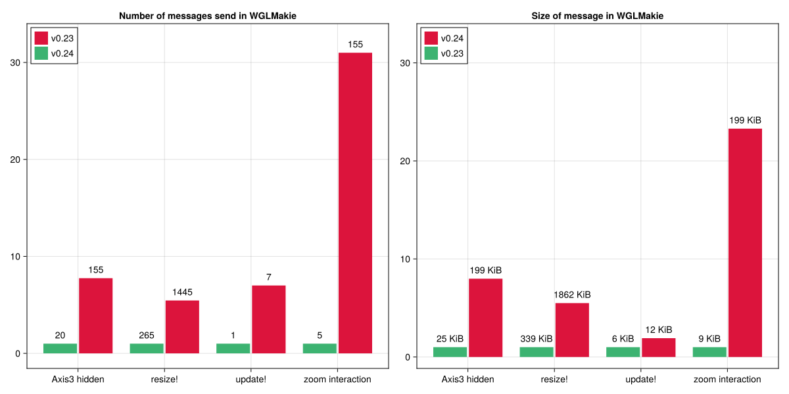

# Makie v0.24

We're excited to announce the release of Makie v0.24, a major milestone that represents one of the most significant internal improvements to the plotting ecosystem in the past five years. This update builds upon our recent [v0.23 release](https://makie.org/website/blogposts/v0.23.0/), and we recommend reading about those improvements first if you haven't already.

While v0.23 introduced several breaking changes with immediate benefits, v0.24's improvements are primarily internal. We chose to release these versions separately to allow the community to benefit from v0.23's enhancements while giving ecosystem maintainers more time to adapt to v0.24's deeper architectural changes.

Makie v0.24 focuses on a comprehensive overhaul of our internal architecture, specifically replacing Observables in our backend code with a more robust system. This fundamental change touches nearly every component of the codebase, making it one of our most ambitious refactoring efforts to date.

The scope of these improvements was so significant that we initially considered releasing this as Makie v1.0. However, with several important design decisions still being refined, we've chosen to release this as v0.24. We still target a Makie 1.0 release later this year, building on the solid foundation established by v0.24 without introducing additional breaking changes.

**A Note on Stability:** This release includes major internal improvements that have been thoroughly tested. However, changes of this magnitude can occasionally reveal unexpected edge cases. If you prioritize stability for production work, you may want to wait a few weeks after release before upgrading to allow the community to identify and resolve any issues that may arise.

## Overview

This release features a rework of how plot arguments and attributes are handled. Instead of using Observables we now use a `ComputeGraph` from the new [ComputePipeline](https://docs.makie.org/dev/explanations/compute-pipeline) package.

All the data a plot generates from its inputs to the final backend render object is stored in the graph as nodes. All the computations that connect data are stored as edges. When a plot input is updated, the graph marks every dependent node and edge as out-of-date. When data from an out-of-date node is requested, all related outdated nodes are resolved to compute the up-to-date value.

One of the goals of this refactor was to fix synchronous update issues, i.e., when two or more variables need to update together.
An example would be resizing `x`, `y` as well as the `color` of a scatter plot.
This can now be done with `Makie.update!(plot, arg1 = new_xs, arg2 = new_ys, color = new_color)`.

Another improvement is that we can now poll updates, which helps skip intermediate calculations that happen between draw calls.
This happens in `Axis`, for example, where the layout is calculated iteratively and each iteration updates all involved plots.
The polling also gives us more control over where and when to apply the updates, which is a large step towards making GLMakie plot updating thread safe.
Previously `plot.attribute = new_val` would immediately switch the OpenGL context and upload the new data, which is inherently not thread safe.
Now we can poll the update at a point in time where all OpenGL state is already correctly set and we're on the correct thread to talk with OpenGL.
Finally, we've undertaken a major cleanup of the backend code, improving code sharing across backends and long-term maintainability.

## Performance improvements

Especially for WGLMakie, the performance gains are huge, since we now have much better control over when to calculate updates and when to skip computations.
We used a small [benchmark script](https://gist.github.com/SimonDanisch/bda7660ebfebab5a9a090b16433c31dc) to get some first numbers on the improvements this refactor provides:

```julia
# no-eval
run_example!("resize!", (f, ax, pl) -> resize!(f, rand(500:1000), rand(500:1000))) do
    f = Figure(size = (800, 800))
    for i in 1:3, j in 1:3
        isodd(i + j) ?
            heatmap(f[i, j], rand(500, 500)) :
            scatter(f[i, j], rand(Point2f, 10); color = rand(10))
    end
    f, nothing, nothing
end
update_test = (f, ax, pl) -> update!(pl,
    color = rand(1000), colormap = rand(Makie.all_gradient_names),
    markersize = rand(5:0.001:60)
)
run_example!("update!", update_test) do
    scatter(rand(Point2f, 1000); color = rand(1000), colormap = :turbo, markersize = 20)
end
function trigger_update(f, ax, pl)
    e = events(f)
    e.mouseposition[] = (300, 250)
    e.mousebutton[] = Makie.MouseButtonEvent(Mouse.right, Mouse.press)
    e.mouseposition[] = (350, 250)
    return e.mousebutton[] = Makie.MouseButtonEvent(Mouse.right, Mouse.release)
end
run_example!("zoom interaction", trigger_update) do
    return scatter(rand(Point2f, 1000); color = rand(1000), colormap = :turbo, markersize = 20)
end
run_example!("Axis3", (f, ax, pl) -> (ax.azimuth = rand(-π:0.001:π))) do
    return meshscatter(rand(Point3f, 100), axis = (; type = Axis3))
end
run_example!("Axis3 hidden", (f, ax, pl) -> (ax.azimuth = rand(-π:0.001:π))) do
    f, ax, pl = meshscatter(rand(Point3f, 100), axis = (; type = Axis3))
    hidedecorations!(ax)
    return f, ax, pl
end
```



Performance gains are especially noticeable when interacting with WGLMakie plots over slower network connections, where the reduced computational overhead translates directly to smoother user experiences.

Beyond the raw performance numbers, there's an important qualitative improvement: when using `update!`, all changes are now applied simultaneously in the JavaScript runtime. This eliminates visual artifacts that previously occurred during larger updates, where individual changes would arrive in separate messages, creating temporarily incorrect intermediate states (such as when updating x, y, and z coordinates for a heatmap).

Looking forward, we're still in the early stages of fully leveraging the ComputeGraph's capabilities. Many optimizations remain to be implemented, and the graph itself can be further optimized. Currently, we're still converting to Observables internally quite often, since we haven't yet updated all Blocks and recipes (Axis, LineAxis, Axis3, poly, etc.) to use the new compute graph natively. These conversions force immediate updates, disabling our ability to discard intermediate calculations - one of the key advantages of the new system.

We welcome community contributions to help migrate these components, as our core team needs to focus on the upcoming Makie 1.0 release.

# Breaking Changes

The transition to ComputeGraph represents a fundamental shift in how Makie handles plot data and attributes internally. While we've worked hard to maintain backward compatibility where possible, some changes were unavoidable due to the architectural improvements. The breaking changes primarily affect advanced users who work directly with Makie's internal systems - most standard plotting workflows should continue to work unchanged.

The most significant impacts are in three areas: custom recipe development, lighting systems, and text rendering. We've organized the changes by impact area to help you understand which sections are relevant to your use case.

## Attribute Handling in Recipes

Some styles of passing attributes through a recipe no longer work, as `plot.attributes` no longer uses the Dict-like `Attributes` type.
Instead, it is now a `ComputeGraph` which is less mutable.

#### Splatting

Splatting "Attributes" no longer works:

```julia
# no-eval
plot!(parent, args...; kwargs..., parent.attributes...)
# or
attr = Attributes(parent)
plot!(parent, args...; attr...)
```

Instead attributes can be passed directly as the second argument:

```julia
# no-eval
attr = Attributes(parent)
plot!(parent, attr, args...; kwargs...)
```

Keyword arguments take priority over the nodes in `attr` here.
Any node that is not compatible with `plot!()` will be ignored.

#### Copy - Modify

Copying and adjusting attributes also does not work anymore:

```julia
# no-eval
attr = copy(Attributes(plot)) # MethodError: copy(::ComputeGraph)
pop!(attr, :removed) # MethodError: pop!(::ComputeGraph, ...)
attr[:changed] = value # MethodError: setindex!(::ComputeGraph, ...)
plot!(parent, attr, args...; kwargs...)
# or plot!(parent, args...; kwargs..., attr...)
```

Instead of this you can again directly pass attributes.
Instead of overwriting `attr[key] = val` you can pass that attribute as a keyword argument, and instead of `pop!(attr, key)` you can set a constant default or make that attribute available in your recipe.

```julia
# no-eval
attr = Attributes(plot)
plot!(parent, attr, args..., changed = value, popped = const_val)
```

#### `replace_automatic!()`

`replace_automatic!()` has been removed as it is incompatible with the new `ComputeGraph`. Instead of

```julia
# no-eval
obs = replace_automatic!(() -> attr[:default], attr, :maybe_automatic)
plot!(..., something = obs)
```

use

```julia
# no-eval
# ComputeGraph (preferable)
map!(default_automatic, attr, [:maybe_automatic, :default], :new_name)
plot!(parent, ..., something = parent.new_name)

# Observable
obs = map(default_automatic, plot.maybe_automatic, plot.default)
plot!(parent, ..., something = obs)
```

#### Replacing Observables with `ComputeGraph` nodes

Refactoring recipes to use the `ComputeGraph` instead of `Observables` is **not necessary**.
However, as we mentioned before, it may improve performance and fits well with the discussion on recipes here.

Before, you typically wrote code like this:

```julia
# no-eval
# optional `plot` argument, could also be lift, @lift, map!
output1 = map(plot, plot.obs1, plot.obs2, ...) do args...
    return some_calcuation(args...)
end

output2 = Observable(...)
# optional `plot` argument, could also be on
onany(plot, plot.obs1, plot.obs2, ...) do args...
    output2[] = some_calculation(args...)
end
```

These functions can be replaced with a new `map!(callback, graph, inputs, outputs)` function introduced for the `ComputeGraph`.
`inputs` is either a `Symbol` or `Vector{Symbol}` referring to all nodes that go into the calculation.
`outputs` is also either a `Symbol` or `Vector{Symbol}` which names the output or outputs of the calculation.
The outputs should be unique, i.e., there should only be one `map!()` writing to them.
They will be created by this function.
The `callback` is more or less the same as with `Observables` - a function that takes the input values as arguments and returns one value per output.

```julia
# no-eval
# map() example
map!(plot.attributes, [:obs1, :obs2, ...], :output1) do args...
    return some_calculation(args...)
end

# onany example - no need for special handling anymore
map!(plot.attributes, [:obs1, :obs2, ...], :output2) do args...
    return some_calculation(args...)
end

# A Vector of outputs requires returning a tuple:
map!(plot.attributes, [:obs1, :obs2], [:multi1, multi2]) do args...
    result1, result2 = some_calculation(args...)
    return result1, result2
end
```

After calling `map!()` the outputs will be part of the compute graph.
You can get them by indexing the plot, e.g. `plot.output1`, and pass them to a child plot using keyword arguments or, if they are correctly named, by passing `plot.attributes`.

## Lights

Lights are now handled by the ComputeGraph of the scene. Because of this, lights no longer contain Observables and need to be updated through the scene/compute graph instead. For this, a new set of helper functions has been added:

-   `get_lights(scene)` returns the current lights vector (without the ambient light)
-   `set_lights(scene, lights)` replaces the current lights with the given ones (excluding ambient)
-   `set_ambient_light!(scene, color)` sets the color (and intensity) of the ambient light
-   `set_light!(scene, n, light)` replaces the n-th light in the light vector with the given one
-   `set_light!(scene, n; fields...)` updates a field of the n-th light in the light vector
-   `push_light!(scene, light)` adds a light to the light vector
-   `set_directional_light!(scene; [color, direction, camera_relative])` adjusts the directional light of the scene if it is the only available light other than the ambient light. (I.e., the scene is in FastShading mode)

The `shading` attribute (on a plot level) has also changed back to a `Bool`.
The decision between `FastShading` and `MultiLightShading` is now handled by the scene instead.
You can also force the scene to pick one with `set_shading_algorithm!(scene, choice)`.

## Text

Text has been refactored to rely solely on the compute graph and avoid the nested structure it had before. While this may be considered internal, some recipes (and Blocks) do rely on the old structure. Usually this is for some kind of bounding box. To simplify working with them, we added a new set of functions:

| Includes (cumulative) | per character | per string |
| --- | --- | --- |
| characters, fontsize | `raw_glyph_boundingboxes()` | |
| string layouting, rotation, offset | `fast_glyph_boundingboxes` | `fast_string_boundingboxes()` |
| markerspace positions | `glyph_boundingboxes()` | `string_boundingboxes()` |

All of the above return bounding boxes in `markerspace`.
For bounding boxes transformed back to `space`, we added `full_boundingbox()` which returns a bounding box per plot.
All of these functions have two more variants: `register_...()` which just registers the computation, and `..._obs()` which returns an observable listening to the computation.
They should replace calls to `unchecked_boundingbox()`, `gl_bboxes()`, `string_boundingbox()`, etc.

Note that reacting to these to update inputs of the same text may result in infinite loops.

## MakieCore removed

MakieCore was introduced in 2021 - before package extensions were on the horizon - as a minimal, lightweight import for other packages that want to introduce Makie recipes.
There was always a tension with MakieCore where to draw the line between "core" and other functionality, leading users to request more and more API to be added to it over time.
When package extensions became available, the existence of MakieCore confused many developers who were unsure which was the right way to integrate Makie into their packages.

To simplify this situation going forward, we have decided to remove MakieCore and reintegrate all of its code into Makie.
That means a package extension on Makie is the suggested solution to add plotting functionality in a lightweight way.
MakieCore's functions and types have not been renamed, so a switch from MakieCore to Makie as a dependency should mainly involve a search-and-replace of MakieCore to Makie.
As a starting point, the docs have a minimal example how to use Makie as a [package extension](https://docs.makie.org/dev/explanations/recipes#Makie-Package-Extension).

## Package Organization

The source code for Makie used to be part of the top-level directory of the Makie repository.
This caused the Makie module to include everything in the repository, i.e., also all the backends and other infrastructure.
Each backend module would be downloaded and stored separately, creating a lot of duplicate data.
We have now moved the Makie source into its own Makie directory to fix this issue.
We have also moved assets to an artifact, which means they do not need to be downloaded again with every update.

## Other breaking changes

- `annotations!()` has been removed (use `text!` instead)
- `@recipe PlotType (argnames...)` now controls the names of the converted arguments and thus has to match the output of `convert_arguments(::PlotType, ...)`
- `local_update!(::Voxels)` now requires the updated data to be passed. I.e. `Makie.local_update!(plot, new_value, is, js, ks)`
- `patchcolor` is now opaque to improve the look of 3D meshes with default colors and avoid decorations from being visible through some plots by default

# Fixes

- `surface()` now correctly aligns colors for 2x2 matrices in WGLMakie
- `meshscatter()` with per-element `uv_transform` now works in WGLMakie
- `PolarAxis` now considers text rotation when reserving space for tick labels
- `LaTeXStrings` now project lines correctly in `markerspace != :pixel`. Their line width is still incorrect though
- 2x2 `surface()` plots in CairoMakie and WGLMakie now plot at the correct z values
- `arrows3d()` now include lighting attributes
- `annotation!()` plots now work correctly with transform functions and include fontsize
