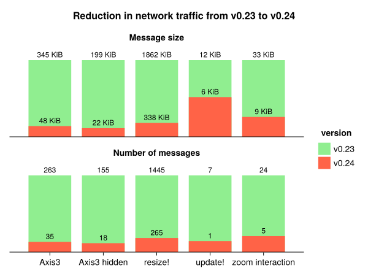

# General Information

This release features a rework of how plot arguments and attributes are handled. Instead of using Observables we now use a `ComputeGraph`.

All the data a plot generates from its inputs to the final backend renderobject are stored in the graph as nodes. All the computations that connect data are stored as edges. When a plot input is updated, the graph marks every dependent node and edge as out-of-date. When data from an out-of-date node is requested, all related outdated nodes are resolved to compute the up-to-date value.

One of the goals of this refactor was to fix synchronous update issues, i.e. when two or more variables need to update together. An example would be adding a new value to the `x` and `y` values of a scatter plot. This can now be done with `Makie.update!(plot, arg1 = new_xs, arg2 = new_ys)`.
Another improvement is, that we can now poll updates, which helps to skip intermediate calculations that happen inbetween draw calls, like it happens e.g. in `Axis`, where the layout is calculated iteratively where each iteration updates all involved plots.
The polling also gives us more control where to apply the updates, which is a large step towards making GLMakie plot updating thread safe. Previously, `plot.attribute = new_val` would immediately switch the OpenGL context and upload the new data, which is inherently not thread safe, while now we can poll the update at a point in time where all OpenGL state is already correctly set and we're on the correct thread to talk with OpenGL.

## Performance improvements

Especially for WGLMakie, the performance gains are huge, since we now control much better when to calculate updates and when to skip a computations.
We used a small [benchmark script](https://gist.github.com/SimonDanisch/bda7660ebfebab5a9a090b16433c31dc) to get some first numbers on the improvements this refactor provides:

```julia
# no-eval
run_example!("resize!", (f, ax, pl) -> resize!(f, rand(500:1000), rand(500:1000))) do
    f = Figure(size = (800, 800))
    for i in 1:3, j in 1:3
        isodd(i + j) ?
            heatmap(f[i, j], rand(500, 500)) :
            scatter(f[i, j], rand(Point2f, 10); color = rand(10))
    end
    f, nothing, nothing
end
update_test = (f, ax, pl) -> update!(pl,
    color = rand(1000), colormap = rand(Makie.all_gradient_names),
    markersize = rand(5:0.001:60)
)
run_example!("update!", update_test) do
    scatter(rand(Point2f, 1000); color = rand(1000), colormap = :turbo, markersize = 20)
end
function trigger_update(f, ax, pl)
    e = events(f)
    e.mouseposition[] = (300, 250)
    e.mousebutton[] = Makie.MouseButtonEvent(Mouse.right, Mouse.press)
    e.mouseposition[] = (350, 250)
    return e.mousebutton[] = Makie.MouseButtonEvent(Mouse.right, Mouse.release)
end
run_example!("zoom interaction", trigger_update) do
    return scatter(rand(Point2f, 1000); color = rand(1000), colormap = :turbo, markersize = 20)
end
run_example!("Axis3", (f, ax, pl) -> (ax.azimuth = rand(-π:0.001:π))) do
    return meshscatter(rand(Point3f, 100), axis = (; type = Axis3))
end
run_example!("Axis3 hidden", (f, ax, pl) -> (ax.azimuth = rand(-π:0.001:π))) do
    f, ax, pl = meshscatter(rand(Point3f, 100), axis = (; type = Axis3))
    hidedecorations!(ax)
    return f, ax, pl
end
```



As one can see, there are large gains from the refactor, which are especially noticeable when interacting with WGLMakie plots over a slow connection.
Something not entirely noticeable in the Benchmark is, that when using `update!`, all updates are now applied at the same time in JS, which avoids artifacts for larger/slower updates, where previously each update would come in seperate messages, creating incorrect states inbetween (e.g. updating x, y, z for a heatmap/image).

We're still missing a lot of optimizations to fully use the power of the compute graph, and the graph itself can still be optimized.
As an example, we're still converting to Observables internally a lot, since we haven't had time to update all Blocks and recipes (Axis/LineAxis/Axis3/poly/...) to use the new compute graph, which does in some places currently almost double the work.

Any help to crowd source this will be much appreciated, since we need to concentrate on releasing Makie 1.0 from here on.

# Breaking Changes

## Attribute Handling in Recipes

Some styles of passing attributes through a recipe no longer work.

#### Splatting

Splatting "Attributes" no longer works, because attributes are now a `ComputeGraph` instead of the Dict-like `Attributes`.

```julia
# no-eval
plot!(parent, args...; kwargs..., parent.attributes...)
# or
attr = Attributes(parent)
plot!(parent, args...; attr...)
```

Instead they can be passed directly as the second argument:

```julia
# no-eval
attr = Attributes(parent)
plot!(parent, attr, args...; kwargs...)
```

Keyword arguments take priority over the nodes in `attr` here. Any node that is not compatible with `plot!()` will be ignored.

#### Copy - Modify

Copying and adjusting "Attributes" does not work anymore for the same reason

```julia
# no-eval
attr = copy(Attributes(plot)) # MethodError: copy(::ComputeGraph)
pop!(attr, :removed) # MethodError: pop!(::ComputeGraph, ...)
attr[:changed] = value # MethodError: setindex!(::ComputeGraph, ...)
plot!(parent, attr, args...; kwargs...)
# or plot!(parent, args...; kwargs..., attr...)
```

Instead of this you can again directly pass attributes. Instead of overwriting `attr[key] = val` you can pass that attribute as a keyword argument. Instead of deleting `pop!(attr, key)` you can [TODO]

```julia
# no-eval
attr = Attributes(plot)
plot!(parent, attr, args..., changed = value, TODO)
```

#### `replace_automatic!()`

`replace_automatic!()` has been removed as it is incompatible with the new `ComputeGraph`. Instead of

```julia
# no-eval
obs = replace_automatic!(() -> attr[:default], attr, :maybe_automatic)
plot!(..., something = obs)
```

use

```julia
# no-eval
# ComputeGraph (preferable)
map!(default_automatic, attr, [:maybe_automatic, :default], :new_name)
plot!(parent, ..., something = parent.new_name)

# Observable
obs = map(default_automatic, plot.maybe_automatic, plot.default)
plot!(parent, ..., something = obs)
```

## Lights

Lights are now handled by the ComputeGraph of the scene. Because of this lights no longer contain Observables and need to be updated through the scene/compute graph instead. For this a new set of helper functions has been added:

-   `get_lights(scene)` returns the current lights vector (without the ambient light)
-   `set_lights(scene, lights)` replaces the current lights with the given ones (excluding ambient)
-   `set_ambient_light!(scene, color)` sets the color (and intensity) of the ambient light
-   `set_light!(scene, n, light)` replaces the n-th light in the light vector with the given one
-   `set_light!(scene, n; fields...)` updates a field of the n-the light in the light vector
-   `push_light!(scene, light)` adds a light to the light vector
-   `set_directional_light!(scene; [color, direction, camera_relative])` adjusts the directional light of the scene if it is the only available light other than the ambient light. (I.e. the scene is in FastShading mode)

The `shading` attribute has also changed back to a `Bool`. The decision between `FastShading` and `MultiLightShading` is now handled by the scene instead. You can also force the scene to pick one with `set_shading_algorithm!(scene, choice)`.

## Text

Text has been refactored to rely solely on the compute graph and avoid the nested structure it had before. While this may be considered internal, some recipes (and Blocks) do rely on the old structure. Usually this is for some kind of boundingbox. To simplify working with them, we added a new set of functions:

-   `raw_glyph_boundingboxes(plot)` returns a markerspace boundingbox per glpyh which considers only the glyph and the fontsize.
-   `fast_glyph/string_boundingboxes(plot)` returns a markerspace boundingbox per glyph/string which considers the above, string layouting, rotation and offset.
-   `glyph/string_boundingboxes(plot)` returns a markerspace boundingbox per glyph/string which considers the above and positions.
-   `full_boundingbox(plot, target_space)` returns a single boundingbox considering the above, transformed into `target_space`.

These functions should replace calls to `unchecked_boundingbox()`, `gl_bboxes()`, `string_boundingbox()` etc. Each of them also has a `register_$(name)!(plot)` version which registers the associated compute node, and a `$(name)_obs(plot)` version which returns an observable instead of a (vector of) boundingbox(es). Note that updating text inputs with these may result in infinite loops.

## MakieCore removed

...

## Package Organization

-   Makie/src -> Makie/Makie/src
-   asset folder to artifact
-   should reduce package size by avoiding unnecessary/duplicate data to be bundled with the Makie module

## Other breaking changes

-   `annotations!()` has been removed (use `text!` instead)
-   `@recipe PlotType (argnames...)` now controls the names of the converted arguments and thus has to match the output of `convert_arguments(::PlotType, ...)`
-   `plot.attribute[] = value` no longer works. Use `plot.attribute = value`

# Fixes

-   `surface()` now correctly aligns colors for 2x2 matrices in WGLMakie
-   `meshscatter()` with per-element `uv_transform` now works in WGLMakie
-   `local_update!(::Voxels)` now requires the updated data to be passed. I.e. `Makie.local_update!(plot, new_value, is, js, ks)`
